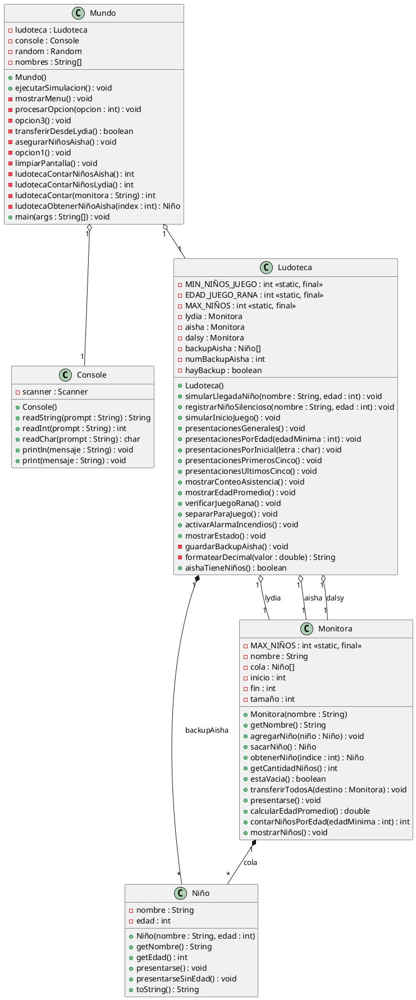
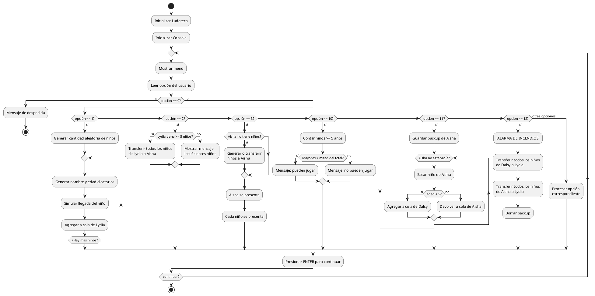
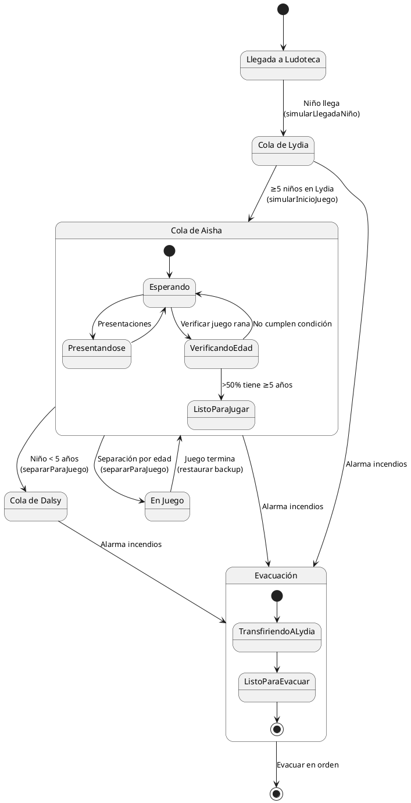
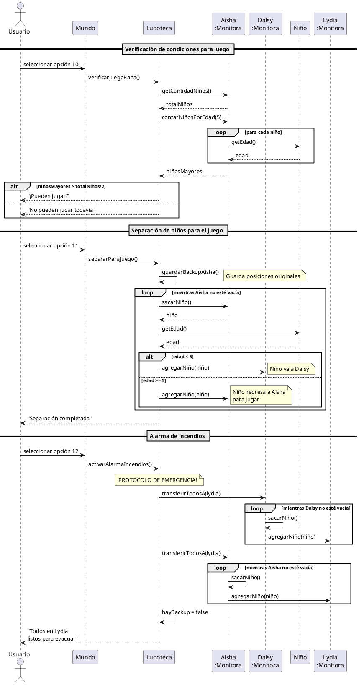

# Diagramas UML - Sistema de Gestión de Ludoteca

Código fuente de plantUML aquí

## ️ Diagrama de Clases

Este diagrama muestra la estructura completa del sistema con todas las clases, atributos, métodos y relaciones.

---

## Diagrama de Actividades

Este diagrama representa el flujo de ejecución del programa, mostrando las diferentes opciones del menú y sus acciones.

---

## Diagrama de Estados

Este diagrama muestra los diferentes estados por los que puede pasar un niño en el sistema.

---

## Diagrama de Secuencia

Este diagrama detalla las interacciones entre objetos para los escenarios más importantes.

---