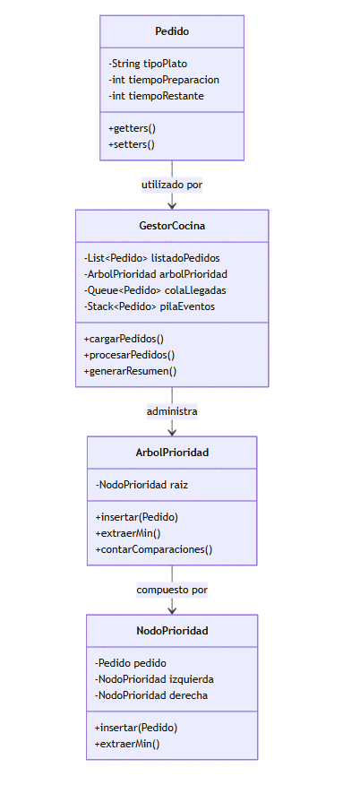

# Propuesta de Solución para el Reto RCCCF

## Introducción

El reto RCCCF simula la gestión de pedidos en una cocina donde cada pedido tiene un tiempo de preparación variable, y el cocinero siempre selecciona el pedido con **menor tiempo restante**. Esta dinámica requiere que se registre la llegada de nuevos pedidos y se procesan minuto a minuto.

El diagrama UML incluido más abajo es una **representación conceptual** de cómo podrían organizarse las clases y las estructuras de datos para abordar el reto.

## Objetivo General de la Propuesta

Modelar y procesar la información del reto RCCCF aplicando estructuras de datos aprendidas en clase. La propuesta debe permitir:

* Organizar los datos siguiendo una relación clara entre entidades.
* Aplicar estructuras que optimicen la selección del pedido más corto.
* Facilitar futuras extensiones (estadísticas, métricas de eficiencia, etc.).

---

## Estructura Conceptual

### **1. Representación de Pedidos**

Clase `Pedido`, que almacena:

* Tipo de plato.
* Tiempo estimado de preparación.
* Tiempo restante.

Se pueden administrar mediante **listas** para mantener un registro completo.

### **2. Control de Prioridad de Preparación**

Para seleccionar siempre el pedido con menor tiempo de preparación:

* Un **Árbol de Prioridad** (por ejemplo, árbol binario mínimo) o estructura equivalente.
* Permite extraer rápidamente el pedido más corto y contabilizar comparaciones.

### **3. Registro de Eventos Secuenciales**

* Una **Cola** para pedidos recién llegados.
* Una **Pila** opcional para registrar eventos y permitir funcionalidades como deshacer acciones.

### **4. Administrador General del Sistema**

Clase `GestorCocina` que:

* Administra todas las estructuras: lista de pedidos, árbol de prioridad, cola de llegadas y pila de eventos.
* Contiene la lógica de procesamiento minuto a minuto.
* Genera estadísticas y resúmenes al final de la jornada.

---

## UML Propuesto (Mermaid)

Este diagrama representa la organización general de clases y su interacción conceptual:

