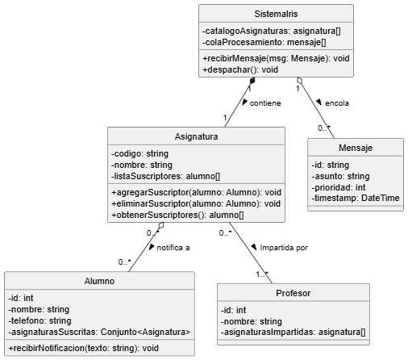
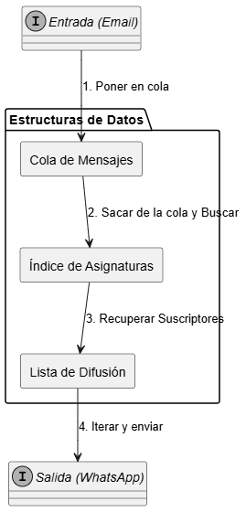

# Reto 006: Estructuras de Datos para Iris

Esta propuesta detalla el diseño de las estructuras de datos para el sistema **Iris**, un redirector de mensajes estructurados que captura envíos, los resume mediante IA y los notifica a los suscriptores vía WhatsApp.

## 1. Diagramas UML

A continuación se presentan los diagramas que modelan la solución, especificando las estructuras de colección concretas utilizadas para optimizar las operaciones críticas.

### Diagrama de Clases (Estructuras de Datos)

Este diagrama detalla cómo el sistema central indexa la información para un acceso rápido y cómo se relacionan las entidades.

### Diagrama de Componentes y Flujo de Datos

Visualización del flujo de la información a través de las estructuras propuestas.

## 2. Justificación de las Estructuras

Se han seleccionado estructuras específicas para garantizar la eficiencia algorítmica (Notación Big O) en cada fase del proceso.

| Operación | Estructura Elegida | Justificación (Por qué) |
| :--- | :--- | :--- |
| **Identificar Asignatura** | Árbol Binario de Búsqueda | **Eficiencia Logarítmica.** Aunque no es instantáneo, un árbol permite encontrar una asignatura en tiempo logarítmico. Es mucho más rápido que recorrer una lista y nos permite mantener el catálogo de asignaturas ordenado alfabéticamente si fuera necesario listar. |
| **Gestionar Suscripciones** | Conjunto | **Unicidad.** Un Set garantiza matemáticamente que un alumno no se suscriba dos veces a la misma asignatura y permite verificar la existencia de una suscripción en tiempo constante. |
| **Cola de Mensajes** | Cola de Prioridad | **Orden y Urgencia.** Desacopla la recepción del procesamiento para manejar picos de tráfico sin saturar los servicios externos (IA/WhatsApp). La prioridad asegura que mensajes urgentes se procesen antes. |
| **Envío Masivo (Fan-out)** | Lista Enlazada | **Recorrido.** Para el envío masivo es necesaria una iteración secuencial. La lista enlazada es eficiente si la lista de suscriptores sufre inserciones y eliminaciones frecuentes. |

## 3. Compromisos 
Se aceptan los siguientes costes para maximizar el rendimiento y la estabilidad:

**1. Consumo de Memoria**

Coste: El uso de una estructura enlazada dinámica (Árbol) implica que cada nodo (Asignatura) requiere memoria adicional para almacenar los punteros a sus hijos (izquierdo y derecho) y a las estructuras internas (cola y lista), además de los propios datos.

Aceptación: Dado el volumen finito de asignaturas (< 1000), la sobrecarga de memoria por almacenar referencias es insignificante en los ordenadores modernos y se justifica plenamente para mantener el catálogo ordenado y accesible.

**2. Latencia de Procesamiento (Colas)**

Coste: La introducción de una cola intermedia en cada nodo añade una latencia inherente entre la recepción del mensaje y su envío final. El mensaje no se reenvía inmediatamente, sino que espera su turno de procesamiento.

Aceptación: Este retraso es una decisión de diseño necesaria para garantizar la estabilidad, permitiendo "aplanar" los picos de tráfico y evitar saturar los servicios externos (como la API de IA o el servidor de correo) en momentos de alta carga.

**3. Coste Computacional de Búsqueda y Reequilibrio**

Coste: Acceder a una asignatura requiere recorrer el árbol desde la raíz (complejidad logarítmica), lo cual consume más ciclos de CPU que un acceso directo a un array. Además, insertar nuevas asignaturas puede requerir operaciones de reequilibrio si se opta por un árbol balanceado.

Aceptación: En un sistema de notificaciones informativas, la entrega de un mensaje extra no constituye un fallo crítico del sistema.

**4. Consistencia Eventual**

Coste: Existe una ventana de tiempo donde un alumno recién dado de baja podría recibir un último mensaje si este ya había sido extraído de la cola y estaba en proceso de resumen/envío.

Aceptación: En un sistema de notificaciones informativas, la entrega de un mensaje residual no constituye un fallo crítico ni de seguridad.

## 4. Casos Límite 

- **Asignaturas sin alumnos suscritos:**

El sistema verifica si listaSuscriptores está vacía. Si es así, detiene el proceso inmediatamente. No se invoca a la IA (ahorrando costes) ni se intenta ningún envío. Se registra el evento en los logs.

- **Alumnos sin asignatura inscrita:**

El objeto Alumno permanece en la base de datos pero su Asignatura está vacío. Al no estar referenciado en ninguna lista de difusión activa, el sistema de envío nunca iterará sobre él, por lo que no consume recursos de procesamiento.

- **Exalumnos (Bajas):**

Al procesar una baja, se iteran los códigos de asignatura que tenga el alumno. Para cada código, se realiza una búsqueda en el árbol para encontrar el nodo de la Asignatura. Una vez en el nodo, se busca al alumno en la lista enlazada y se elimina. Es una operación con coste, pero poco frecuente.

- **Mensajes que no provienen de una asignatura (Spam o Errores):**

Si al buscar el código extraído del asunto la búsqueda en el árbol termina sin encontrar el nodo (devuelve null), el mensaje se clasifica como "No categorizado". Se descarta o se envía a una cola de logs, sin entrar en el flujo principal.

- **Mensajes no enviados (Fallo en WhatsApp):**

El sistema implementa un manejo de errores dentro del bucle de envío. El fallo de un envío individual no interrumpe el proceso para el resto de la lista. Los fallos se pueden derivar a una cola de reintentos con un límite de intentos.