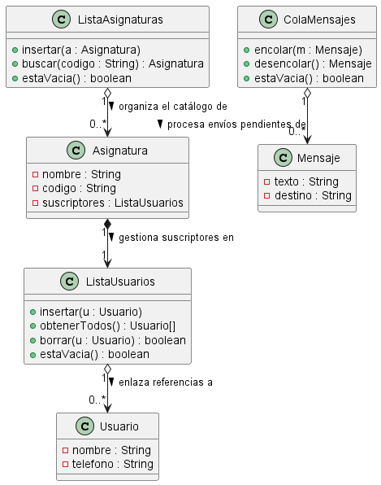

# Diseño de Estructuras de Datos - Proyecto Iris

## Diagrama de la estructura de datos 

## 1. Justificación

### A. Almacenar Suscriptores en una Asignatura
* **Estructura:** `ListaUsuarios` (Implementación propia basada en Lista Enlazada).
* **Operación Soporte:** `insertar(Usuario u)`.
* **Justificación:**
    * **Crecimiento Dinámico:** Al igual que en la práctica de la asignatura, no podemos predecir cuántos alumnos tendrá una materia. Un array estático se llenaría. Hemos creado una clase dedicada `ListaUsuarios` que enlaza nodos dinámicamente, permitiendo añadir suscriptores sin límite de memoria preasignado.
    * **Recorrido:** El método `obtenerTodos()` o un iterador interno permite recorrer esta lista específica para enviar los mensajes a cada objeto `Usuario` almacenado.

### B. Gestionar el Catálogo de Asignaturas
* **Estructura:** `ListaAsignaturas` (Implementación propia basada en Lista Enlazada).
* **Operación Soporte:** `buscar(String codigo)`.
* **Justificación:**
    * Necesitamos guardar objetos `Asignatura`. En lugar de reutilizar código complejo, hemos creado una estructura `ListaAsignaturas` idéntica a la anterior pero tipada específicamente para este objeto. Esto facilita la búsqueda secuencial por el atributo `codigo` de la asignatura.

### C. Procesar Mensajes de WhatsApp
* **Estructura:** `ColaMensajes` (Implementación propia basada en Cola/Queue).
* **Operación Soporte:** `encolar(Mensaje m)` y `desencolar()`.
* **Justificación:**
    * **Orden FIFO:** La comunicación requiere orden cronológico estricto. Hemos adaptado la clase `Queue` para manejar objetos `Mensaje`. Al usar punteros al principio y final, garantizamos que el primer mensaje en entrar es el primero en salir hacia la API de WhatsApp.

---

## 2. Compromisos

Al no usar librerías estándar ni genéricos, asumimos los siguientes costes:

* **Duplicación de Código:**
    * *El Sacrificio:* Hemos tenido que programar la lógica de la lista enlazada dos veces (`ListaUsuarios` y `ListaAsignaturas`) y la de la cola una vez (`ColaMensajes`).
    * *Coste Aceptado:* Esto aumenta el tamaño del código fuente y el riesgo de errores (si falla la lógica de nodos, falla en tres sitios), pero simplifica la comprensión del tipo de dato que se maneja en cada momento.
* **Búsqueda Secuencial (O(n)):**
    * *El Sacrificio:* Para encontrar una asignatura, `ListaAsignaturas` debe recorrerse desde el inicio.
    * *Coste Aceptado:* Aceptamos la lentitud en la búsqueda a cambio de una implementación sencilla y dinámica que no desperdicia memoria RAM.

---

## 3. Casos Límite

### Asignaturas sin alumnos
* **Manejo:** La clase `Asignatura` inicializa su `ListaUsuarios` vacía. El método de envío comprueba `estaVacia()` antes de intentar nada, evitando errores de punteros nulos.

### Alumnos sin asignatura
* **Manejo:** El objeto `Usuario` existe en memoria pero no está enlazado en ninguna `ListaUsuarios`. No afecta al rendimiento del envío de mensajes.

### Exalumnos (Baja de suscripción)
* **Manejo:** Se requiere implementar un método específico `borrar(Usuario u)` en la clase `ListaUsuarios`.
* **Coste:** Al ser una lista simple, borrar implica recorrer la lista buscando al usuario (coste O(n)) y reajustar los enlaces de los nodos anterior y siguiente.

### Mensajes no enviados
* **Manejo:** Si el envío falla tras hacer `desencolar()`, el sistema puede llamar inmediatamente a `encolar()` con el mismo mensaje. Esto lo coloca al final de la `ColaMensajes` para ser reintentado cuando se procesen los mensajes anteriores.