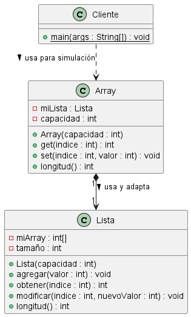

# Vista Pública (Refactorización)

| Cliente.java |
| :--- |
| public static void main(String[] args) |

 

| Array.java |
| :--- |
| public Array(int capacidad) |
| public int get(int indice) |
| public void set(int indice, int valor) |
| public int longitud() |

 

| Lista.java |
| :--- |
| public Lista(int capacidad) |
| public void agregar(int valor) |
| public int obtener(int indice) |
| public void modificar(int indice, int nuevoValor) |
| public int longitud() |

# Diagrama UML 

