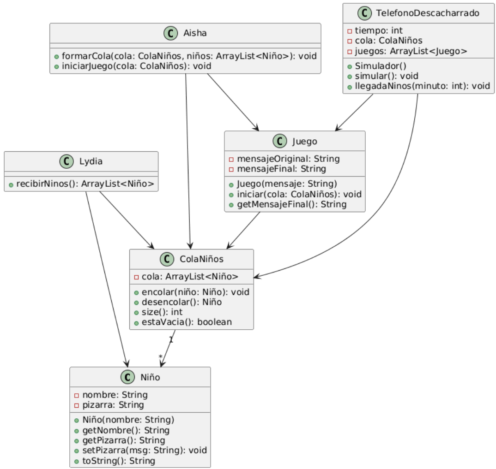

# Reto RCCCF: Simulador de Cocina Optimizada

## Descripción del Sistema

La cocina trabaja bajo un modelo de eficiencia donde **no importa el orden de llegada**, sino la rapidez de preparación.

* **Lógica de Atención:** Cuando el cocinero termina un plato, revisa todos los pedidos pendientes y selecciona **el que se prepare más rápido** (ej.  un café antes de un cocido).
* **Horario:** De 9:00 AM a 9:00 PM (12 horas = 720 minutos).

## Menú y Tiempos de Preparación

Los clientes eligen los platos con una distribución aleatoria uniforme. El tiempo exacto de preparación se calcula aleatoriamente dentro del rango de cada plato.

| Tipo de Plato | Tiempo de Preparación (min) |
| :--- | :---: |
| **Bebida** | 1 - 2 |
| **Café** | 2 - 3 |
| **Colacao** | 2 - 4 |
| **Bocadillo** | 3 - 5 |
| **Ensalada** | 5 - 8 |

## Reglas de la Simulación

1.  **Llegada de Pedidos:**
    * Existe un **40% de probabilidad** de que entre un pedido nuevo cada minuto.
    * Si entra un pedido, se genera aleatoriamente el tipo y su duración específica.

2.  **Gestión de la Cola:**
    * Los pedidos se acumulan en una lista de espera.
    * El cocinero una vez acaba un pedido, empieza con el pedido mas rapido de elaborar.

3.  **Proceso de Cocina:**
    * Se dispone de **1 único cocinero**.
    * La simulación avanza minuto a minuto.
    * Cada minuto, se resta 1 al tiempo restante del pedido que se está cocinando actualmente.

### Diagrama de Clases RCCCF

### Diagrama de Clases refactorizado RCCCF

### Vista pública

|Simulation.java
|-
public static void main(String[] args)

|Restaurant.java
|-
public Restaurant()
public void run()

|ArbolPedidos.java
|-
public ArbolPedidos()
public void insertar(Pedido pedido)
public Pedido extraerMinimo()
public boolean isEmpty()
public int getComparaciones()

|Pedido.java
|-
public Pedido(String nombrePlato, int tiempoPreparacion, int minutoLlegada)
public void restarMinuto()
public boolean estaTerminado()
public String getNombrePlato()
public int getTiempoPreparacion()
public int getTiempoRestante()
public int getMinutoLlegada()

|Nodo.java
|-
public Nodo(Pedido pedido)
public Pedido getPedido()
public int getTiempoPreparacion()
public Nodo getIzquierdo()
public void setIzquierdo(Nodo izquierdo)
public Nodo getDerecho()
public void setDerecho(Nodo derecho)

