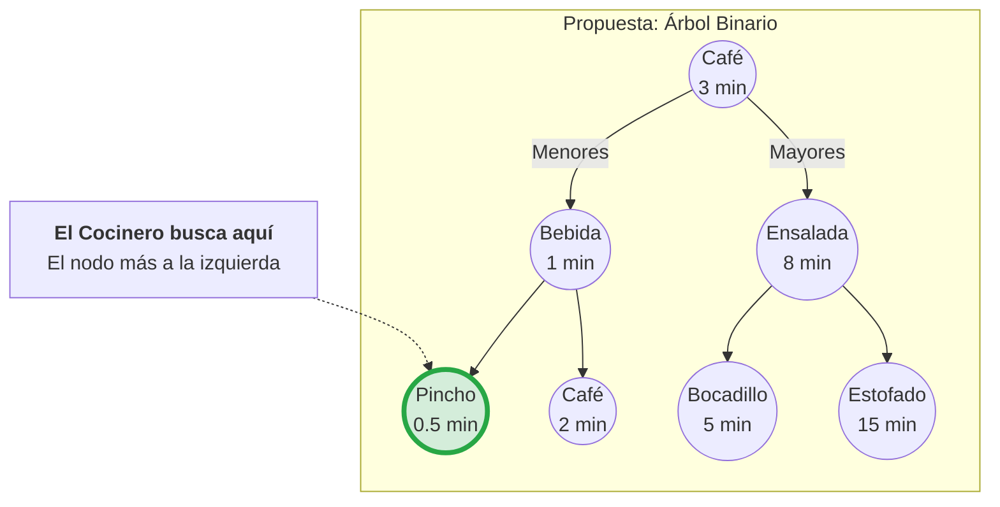
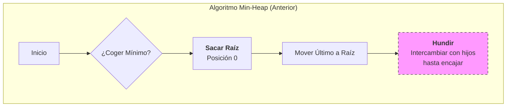
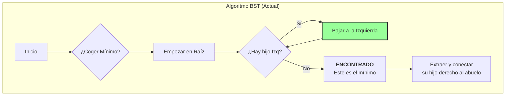
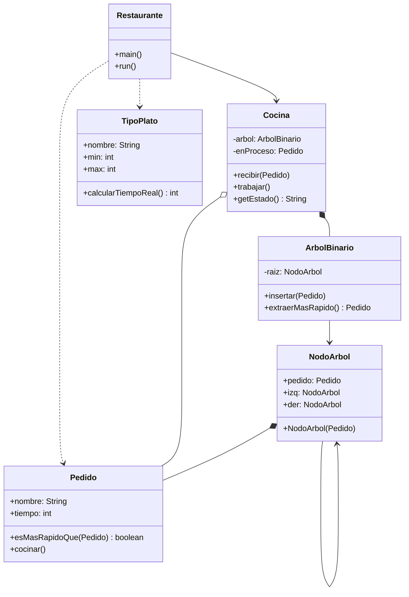

# Refactorización de Propuesta de RCCCF - Reto 005

## Minimalismo

Considerando lo comentado en clase, la propuesta realizada anteriormete con [MinHeap](/entregas/alvaradoCarlos/documentos/README.md) puede verse muy compleja y "adelantada" a los conocimientos actuales, por lo que decidí regresar el enfoque a lo primero que tenia en mente al realizar el reto, hacerlo únicamente con árboles binarios y un recorrido en ***InOrden***.

Básicamente con este enfoque se simplifica el proceso:

- Si los nuevos pedidos son más rápidos van a la izquierda del nodo, y si son más lentos van a la derecha del nodo.

- El pedido más rápido SIEMPRE es el nodo que está más a la izquierda de todos.

- El cocinero gracias a su prioridad irá tomando las ordenes más pequeñas, por lo que recorrerá en ***InOrden*** el árbol y obtendrá la lista de preparación correcta.

## Estructura

La propuesta de estructuración se vé de esta forma:

Esta era la propuesta anterior:

Y la evolución de mi nueva propuesta es asi:

## Clases

El cambio de clases no será tan significativo, únicamente eliminaremos la clase de estructura del MinHeap y crearemos la clase de la estructura del Árbol Binario, más la estructura de cada Nodo para el árbol. Quedando el diagrama de clases de esta forma:

