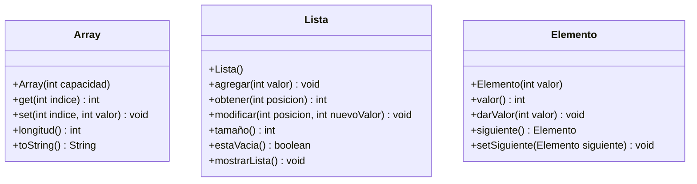

# EDA I - Evaluación Parcial: Array Simulado con Listas

## Integrantes

- Samuel Herrera
- Nicolas Navas
- Carlos Alvarado
- Gabriel Béjar

## Vista Pública

## Objetivo del Proyecto - Refactorización

El objetivo central de la evaluación parcial es construir una estructura de datos que simule el comportamiento de un **Array dinámico** (antiguamente `ArraySimulado`, una de las pautas discutidas en clase fue evitar la notación húngara. Por lo que el nombre pasa a ser únicamente `Array`).

La particularidad de este reto radica en la arquitectura de implementación:

1.  La estructura `Array` debe utilizar una **Lista** como mecanismo de almacenamiento subyacente.
2.  Dicha **Lista** no es una implementación estándar (como `java.util.ArrayList`), sino una implementación personalizada (que llamaremos [`ListaSimulada`](/entregas/alvaradoCarlos/src/SimuladorLista.java)) **proporcionada por otro equipo**.
3.  Esta `ListaSimulada` proporcionada, a su vez, utiliza un **array estático** de base para gestionar sus elementos.

---

## El Desafío Central: Integración y Refactorización

El desafío principal consiste en integrar estas dos capas de abstracción y adaptar el tipado de los datos para cumplir con los requisitos específicos de la evaluación.

### Problema Original: `ListaSimulada` Genérica

La `ListaSimulada` fue diseñada para ser genérica, utilizando el tipo `Object` para almacenar elementos. Esto permite guardar cualquier tipo de dato, pero tiene desventajas significativas para este proyecto:

* **Inseguridad de Tipos:** Se requerirían constantes y peligrosos *castings* (conversiones) de `Object` a `Integer`.
* **Ineficiencia:** Trabajar con `Object` en lugar de `int` implica el uso de clases contenedoras (`Integer`), lo que introduce sobrecarga de memoria (*boxing* y *unboxing*).
* **Requisito Incumplido:** La evaluación exige explícitamente el manejo exclusivo de enteros (`int`).

### Solución Requerida (Refactorización)

Se debe modificar el código de la `ListaSimulada` para **especializarla**. Esto implica:

1.  **Cambiar el Almacenamiento Interno:** Modificar el array base de `Object[] data` a `int[] data`.
2.  **Ajustar la Lógica:** Eliminar cualquier *casting* que ya no sea necesario.

---
