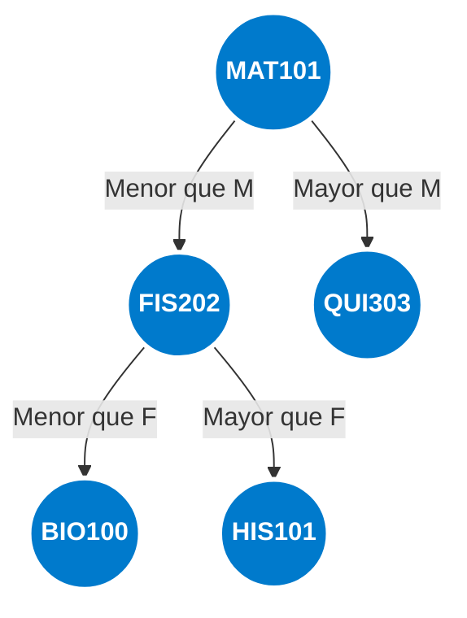

# Reto 006 - Modelado de Estructura para Sistema IRIS

## Definición del Proyecto

El proyecto IRIS esta enfocado en procesar, formatear y redirigir mensajes masivos desde un entorno de Campus Virtual hacia los estudiantes vía WhatsApp.

Los requerimientos tomados en clase son los siguientes:

- El proyecto redirige los mensajes del campus hacia *WhatsApp* o lo que si veamos los alumnos.

- Esto lo hace con edición de los mensajes del campus para ponerlos entendibles y presentables en *WhatsApp*.

- Funciona suscribiendose al sistema, por cada usuario, que tiene una lista de asignaturas de las que quiere recibir la información.

- El sistema recibe los mensajes

- Verifica para que grupo o alumnos son y los reenvìa ya formateados hacia el *WhatsApp* de un alumno o un grupo en su defecto.

Las grandes incognitas para el sistema son el tipo de estructuras de datos que se decidirán para modelarlo. Debido a que tiene ciertos matices muy específicos a la hora de tomar las decisiones correctas en cuanto a eficiencia de las diferentes estructuras.

## Estructuras Planteadas

Para el sistema se plantean utilizar 3 estructuras primordiales:

- **Árboles**: Índice de búsqueda rápida de asignaturas.
- **Colas**: Como buffer de recepción de mensajes al sistema
- **Listas**: Siendo las colecciones de los usuarios o destinatarios finales

### Árbol de Búsqueda Binaria (Asignaturas)

Decidí utilizar un árbol ya que necesitamos encontrar una asignatura específica entre cientos posibles. El Árbol permite "descartar" mitades del directorio en cada paso de comparación del código, siendo mucho más rápido que recorrer una lista lineal. 

Cada nodo del árbol será una asignatura que tendrá un índice y una lista asociada al mismo, la cual tendrá en su interior los usuarios o destinatarios pertenecientes a esa asignatura, quienes recibirán el mensaje.

Funciona ya que el árbol utilizará el orden alfabético de los códigos de asignatura para saber dónde colocar cada nodo (Izquierda o derecha).

Representación:

### Lista Enlazada

Dentro de cada asignatura, el número de alumnos es variable y dinámico. La lista permite inserciones y eliminaciones eficientes sin redimensionar arrays. Además, para enviar el mensaje es obligatorio recorrerlos a todos (iteración), para lo cual la lista es ideal.

Además, Se mantiene una lista secundaria dentro del objeto Estudiante. Esto permite saber en qué materias está inscrito un alumno instantáneamente sin tener que recorrer todo el árbol de asignaturas buscando su nombre.

### Cola de Mensajes (FIFO)

Los mensajes pueden llegar en ráfagas. La Cola garantiza que se procesen en el orden exacto de llegada (First In, First Out) y evita la pérdida de datos si el procesador está ocupado. Además es útil por la gran cantidad de notificaciones que el Campus actualmente envía.

## Diagrama Propuesto

Aquí se encuentra el diagrama propuesto con las clases principales: [Diagrama](/entregas/alvaradoCarlos/documentosUML/diagramaIris.png)

Enlace al [Compromiso y Coste del Diseño](/entregas/alvaradoCarlos/documentos/CompromisoYCoste.md)

Enlace a la [Gestión de Casos Límite del Diseño](/entregas/alvaradoCarlos/documentos/CasosLimite.md)