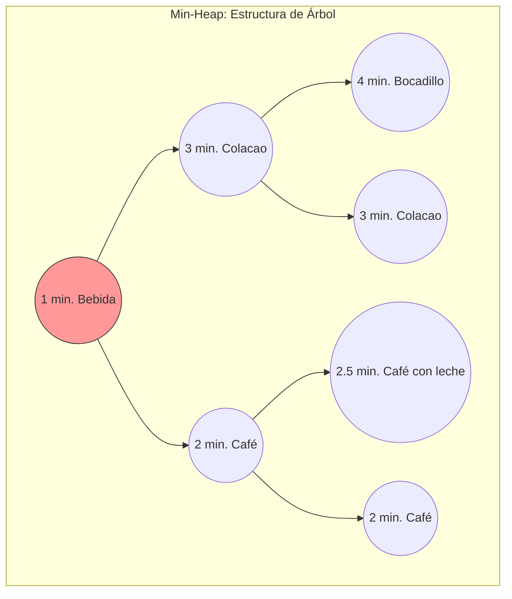
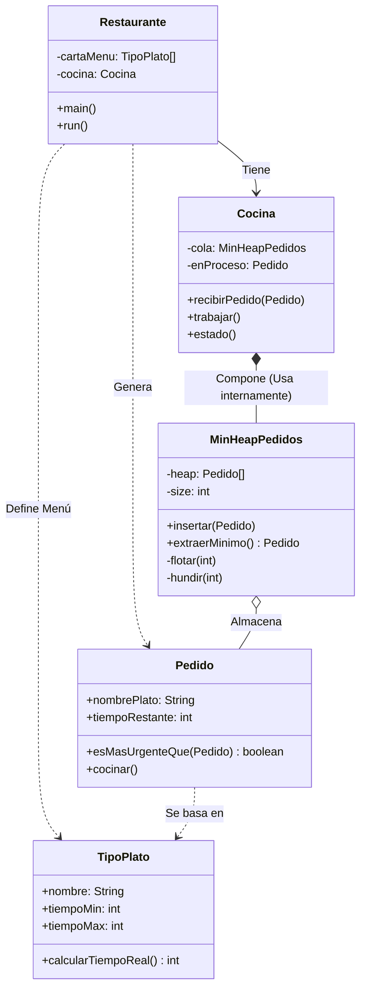

# Diagramas

## Diagrama de Árbol tipo Min-Heap:

```mermaid
graph TD
    subgraph "Min-Heap: Estructura de Árbol"
    N1((1 min. Bebida)) --> N2((3 min. Colacao))
    N1 --> N3((2 min. Café))
    
    N2 --> N4((4 min. Bocadillo))
    N2 --> N5((3 min. Colacao))
    
    N3 --> N6((2.5 min. Café con leche))
    N3 --> N7((2 min. Café))
    end
    
    style N1 fill:#ff9999,stroke:#333,stroke-width:4pxRegla: Solo importa el orden vertical. El de arriba es menor que los de abajo.
```

## Diagrama de Estructura de Clases para Pedidos 

```mermaid
classDiagram
    class Restaurante {
        -cartaMenu: TipoPlato[]
        -cocina: Cocina
        +main()
        +run()
    }

    class Cocina {
        -cola: MinHeapPedidos
        -enProceso: Pedido
        +recibirPedido(Pedido)
        +trabajar()
        +estado()
    }

    class MinHeapPedidos {
        -heap: Pedido[]
        -size: int
        +insertar(Pedido)
        +extraerMinimo() Pedido
        -flotar(int)
        -hundir(int)
    }

    class Pedido {
        +nombrePlato: String
        +tiempoRestante: int
        +esMasUrgenteQue(Pedido) boolean
        +cocinar()
    }

    class TipoPlato {
        +nombre: String
        +tiempoMin: int
        +tiempoMax: int
        +calcularTiempoReal() int
    }

    Restaurante --> Cocina : Tiene
    Restaurante ..> TipoPlato : Define Menú
    Restaurante ..> Pedido : Genera

    Cocina *-- MinHeapPedidos : Compone (Usa internamente)
    MinHeapPedidos o-- Pedido : Almacena

    Pedido ..> TipoPlato : Se basa en
```