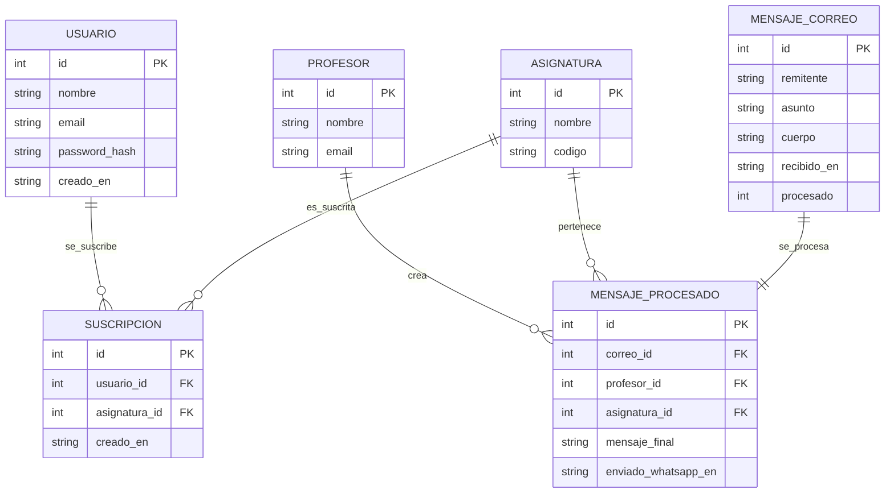

```mermaid
erDiagram

    USUARIO {
        int id PK
        string nombre
        string email
        string password_hash
        string creado_en
    }

    PROFESOR {
        int id PK
        string nombre
        string email
    }

    ASIGNATURA {
        int id PK
        string nombre
        string codigo
    }

    SUSCRIPCION {
        int id PK
        int usuario_id FK
        int asignatura_id FK
        string creado_en
    }

    MENSAJE_CORREO {
        int id PK
        string remitente
        string asunto
        string cuerpo
        string recibido_en
        int procesado
    }

    MENSAJE_PROCESADO {
        int id PK
        int correo_id FK
        int profesor_id FK
        int asignatura_id FK
        string mensaje_final
        string enviado_whatsapp_en
    }

    USUARIO ||--o{ SUSCRIPCION : se_suscribe
    ASIGNATURA ||--o{ SUSCRIPCION : es_suscrita
    PROFESOR ||--o{ MENSAJE_PROCESADO : crea
    ASIGNATURA ||--o{ MENSAJE_PROCESADO : pertenece
    MENSAJE_CORREO ||--|| MENSAJE_PROCESADO : se_procesa
```
