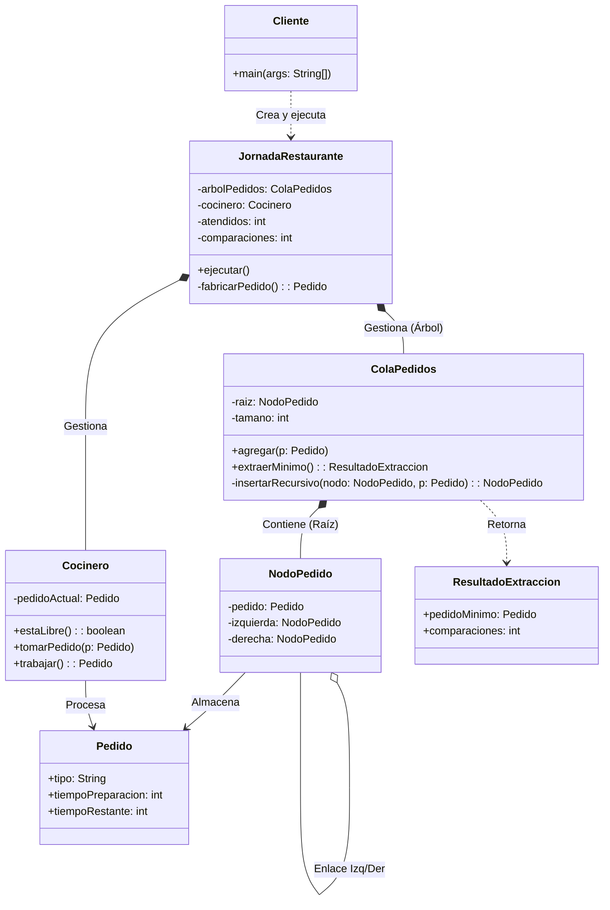

```mermaid
classDiagram
    class Cliente {
        +main(args: String[])
    }

    class JornadaRestaurante {
        -arbolPedidos: ColaPedidos
        -cocinero: Cocinero
        -atendidos: int
        -comparaciones: int
        +ejecutar()
        -fabricarPedido(): Pedido
    }

    class Cocinero {
        -pedidoActual: Pedido
        +estaLibre(): boolean
        +tomarPedido(p: Pedido)
        +trabajar(): Pedido
    }

    class ColaPedidos {
        -raiz: NodoPedido
        -tamano: int
        +agregar(p: Pedido)
        +extraerMinimo(): ResultadoExtraccion
        -insertarRecursivo(nodo: NodoPedido, p: Pedido): NodoPedido
    }

    class NodoPedido {
        -pedido: Pedido
        -izquierda: NodoPedido
        -derecha: NodoPedido
    }

    class Pedido {
        +tipo: String
        +tiempoPreparacion: int
        +tiempoRestante: int
    }

    class ResultadoExtraccion {
        +pedidoMinimo: Pedido
        +comparaciones: int
    }

    Cliente ..> JornadaRestaurante : Crea y ejecuta
    JornadaRestaurante *-- ColaPedidos : Gestiona (Árbol)
    JornadaRestaurante *-- Cocinero : Gestiona
    ColaPedidos *-- NodoPedido : Contiene (Raíz)
    NodoPedido o-- NodoPedido : Enlace Izq/Der
    NodoPedido --> Pedido : Almacena
    Cocinero --> Pedido : Procesa
    ColaPedidos ..> ResultadoExtraccion : Retorna
```