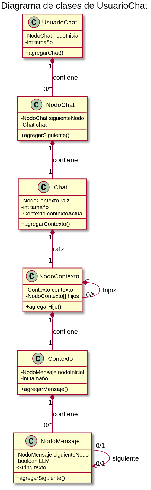
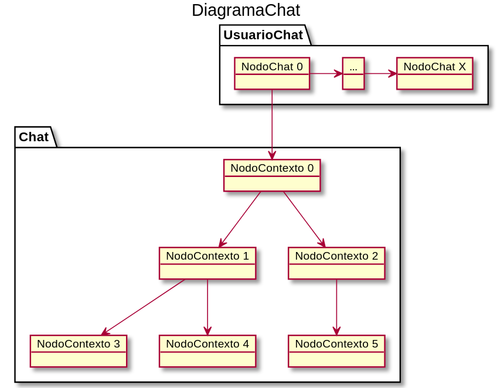
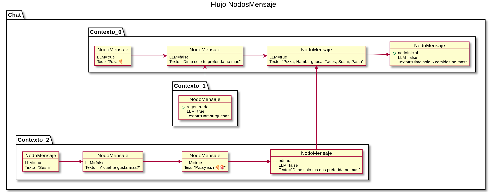

# ED: Contexto para LLM

El problema a resolver es el almacenamiento eficiente de datos para contextualizar a nuestro LLM. Esto es crucial, ya que una estructura indebida genera ineficiencia de rendimiento y latencia al acceder a los datos a gran escala.

## 1.0 Estructura y justificacion
Una estructura eficiente es vital. Debemos asentar las bases utilizando las estructuras primitivas vistas en la asignatura:

- **Árboles**
- **Listas**
- **Pilas**
- **Colas**

No podemos alejarnos de estos principios en cuanto a la estructura que implementaremos.

### 1.1 Lógica de la Solución
Dado que requerimos mantener una ventana de contexto, la estructura principal se diseña para **no recalcular todo el historial constantemente**.

Aprovecharemos la **iteración inversa** (recorrido hacia atrás). Similar a como funciona **Git**, cada mensaje referencia al anterior. Esto genera un **árbol de listas** donde el nodo principal (puntero actual) es el último mensaje enviado de esa rama, permitiendo reconstruir la conversación hacia atrás hasta el origen.

### 1.2 Clases Propuestas
Desglosamos el problema en las siguientes clases para establecer los fundamentos de trabajo:

* **`UsuarioChat`**: Estructura que gestiona la lista de chats del usuario.
* **`NodoChat`**: El nodo contenedor que almacena la referencia a un árbol de conversación.
* **`Chat`**: Estructura de tipo Árbol que contiene los nodos de contexto.
* **`NodoContexto`**: Nodo que apunta a una lista que representa el inicio del hilo de la conversación.
* **`Contexto`**: Lista enlazada compuesta por `NodosMensaje`.
* **`NodoMensaje`**: La unidad de información. Contiene:
    * Metadatos (si fue escrito por Usuario o LLM).
    * El `payload` de texto.

### 1.3 Eficiencia y Rendimiento
Cuando recibamos un mensaje dentro del `Chat`, mantendremos un puntero o lista llamada **`contextoActual`**.

La mayoría del tiempo iteraremos sobre esta referencia, lo que nos permite **añadir mensajes con un coste temporal de $O(1)$** (tiempo constante), evitando recorrer toda la estructura para cada nueva interacción.

### 1.4 Diagramas:

> Imagen 1.4.1: Muestra las diferentes clases que se utilizan para abordar el problema.

> Imagen 1.4.2: Muestra una abstraccion del problema donde se puede ver el la lista de chats y el arbol utilizado y los nodos que continen las listas `Contexto`.

> Imagen 1.4.3: Muestra el flujo de los mensajes para un facil entendimiento de lo que se propone, manteniendo tres hilos de conversacion, el hilo principal, una edicion y una regeneracion de respuesta.

> Imagen 1.4.4: Muestra la solucion del problema al completo con un diagrama explicativo de cada objeto y a donde apunta.

---

## 2.0 Funciones y Operaciones

A continuación se listan todas las funcionalidades del sistema, su implementación algorítmica y su complejidad. Se incluye un índice de frecuencia de uso (escala 1-10).

### 2.1 Añadir mensaje (Usuario)
El usuario envía un input. Se instancia un `NodoMensaje` con el flag `LLM = false`. Este nodo apunta al nodo que estaba en `contextoActual` como su padre. Finalmente, actualizamos el puntero `contextoActual` a este nuevo nodo.

> **Uso:** `[████████████████████] 10/10` | **Complejidad:** $O(1)$ (Inserción directa al final)

### 2.2 Respuesta LLM
Una vez el modelo genera el output, se crea un `NodoMensaje` con el flag `LLM = true`. Se vincula al último mensaje del usuario y el puntero `contextoActual` avanza a este nuevo nodo.

> **Uso:** `[████████████████████] 10/10` | **Complejidad:** $O(1)$ (Inserción directa al final)

### 2.3 Regenerar respuesta
Si el usuario solicita otra respuesta, no sobrescribimos el nodo anterior. Volvemos a tomar el siguiente nodoMensaje (mensaje del usuario) y creamos un **nuevo** `nodoContexto` con una nueva lista `Contexto` (generando asi una nueva rama). El puntero `contextoActual` se mueve a esta nueva "rama", preservando la respuesta anterior en el historial latente y llamamos a la funcion de generar respuesta LLM.

> **Uso:** `[████████████░░░░░░░░] 6/10` | **Complejidad:** $O(1)$ (Creación de nueva rama)

### 2.4 Editar mensaje
Similar a la regeneración, pero aplicado a un nodo de usuario pasado. Se localiza el mensaje a editar y se crea una nueva rama desde el **siguiente nodo**(respuesta del LLM). Esto inicia una línea temporal alternativa sin perder el historial original (Inmutabilidad del historial).

> **Uso:** `[████████░░░░░░░░░░░░] 4/10` | **Complejidad:** $O(1)$ (Creacion nueva rama)

### 2.5 Cambiar rama (Navegación)
Permite al usuario moverse entre diferentes contextos. Algorítmicamente, esto implica mover el puntero `contextoActual` entre los nodos del propio arbol `Chat`.

> **Uso:** `[██████░░░░░░░░░░░░░░] 3/10` | **Complejidad:** $O(1)$ (Acceso directo a hermanos)

### 2.6 Construir VentanaContexto:
Esta es la función crítica para el LLM. Desde `contextoActual`, recorremos los punteros `padre` hacia atrás hasta completar el tamaño de la ventana $W$ (e.g., 40 mensajes) o llegar a la raíz.

> **Uso:** `[████████████████████] 10/10` | **Complejidad:** $O(W)$ (Donde W es el tamaño de ventana, no el total del chat)

### 2.7 Modificar ventana de contexto
Ajuste dinámico del parámetro $W$ (e.g., ampliar memoria a 8k tokens). No altera la estructura de datos, simplemente modifica la condición de parada del bucle de la función **Construir VentanaContexto (2.6)**.

> **Uso:** `[██░░░░░░░░░░░░░░░░░░] 1/10` | **Complejidad:** $O(1)$ (Cambio de variable integer)

### 2.8 Recuperar contexto:
Usado cuando un usuario abandona el chat y vuelve, para recuperar el contexto tal cual estaba. Se recorre todo el contextoActual para obtener los mensajes de vuelta.

> **Uso:** `[████████░░░░░░░░░░░░] 6/10` | **Complejidad:** $O(W)$ (Donde W es el tamaño del contextoActual)

## 3.0 Alternativas barajadas
En el proceso de diseño se consideró el uso de un **Árbol de mensajes con iteración hacia adelante** (hacia los hijos) en lugar de un **Árbol de listas con iteración hacia atrás** (hacia los padres).

### 3.1 Desventajas/Ventajas frente a alternativa

* **Enfoque de Árbol Tradicional (Hacia adelante):**
    * *Ventaja:* Permite visualizar fácilmente todas las ramificaciones posibles desde un mensaje raíz.
    * *Desventaja:* Para construir la ventana de contexto actual, el sistema debe conocer qué rama es la "activa", lo que requiere metadatos adicionales en cada nodo o una gestión compleja de punteros hacia los hijos para no perderse en chats muy ramificados.
* **Enfoque Propuesto (Iteración Inversa - Estilo Git):**
    * *Ventaja:* **Simplicidad y elegancia máxima**. El `contextoActual` siempre sabe quién es su padre, pero el padre no necesita saber cuántos hijos tiene para reconstruir la historia. Esto garantiza que la recuperación de la ventana de contexto sea siempre lineal y directa.
    * *Ventaja:* **Ahorro de memoria**. No necesitamos estructuras de datos complejas en cada nodo de mensaje, solo un puntero al predecesor.

### 3.2 Uso de Arrays Dinámicos frente a Listas Enlazadas
* **Decisión:** Se descartaron los arrays dinámicos para el historial completo debido al coste $O(n)$ en las inserciones de ramas intermedias (ediciones). La **Lista Enlazada** integrada en el árbol permite que la edición de un mensaje a mitad de conversación sea una operación $O(1)$ al crear un nuevo nodo que apunta al pasado existente.

---

## 4.0 Conclusión
La arquitectura propuesta resuelve el problema del **almacenamiento de contexto** priorizando la velocidad de escritura y la agilidad en la generación de respuestas. 

1.  **Eficiencia:** Al utilizar una estructura de **Árbol de Listas con recorrido inverso**, garantizamos que el escalado del chat no afecte al rendimiento. El coste de inserción es constante ($O(1)$) y el de recuperación de ventana depende únicamente del tamaño de la ventana de contexto ($O(W)$), no del historial total.
2.  **Versatilidad:** La solución permite implementar funciones avanzadas como la **edición de mensajes** y la **regeneración de respuestas** sin destruir el historial previo, facilitando una experiencia de usuario rica y no lineal (multiverso de conversaciones).
3.  **Cero duplicacion:** Bajo ningun momento se encuentra uno con nodosMensaje duplicados, asi manteniendo una eficiencia muy alta en el uso de alamacenanmiento de datos.

En definitiva, este sistema de gestión de contexto asegura que el LLM reciba la información relevante de forma inmediata, minimizando la latencia percibida por el usuario y optimizando los recursos del servidor.
