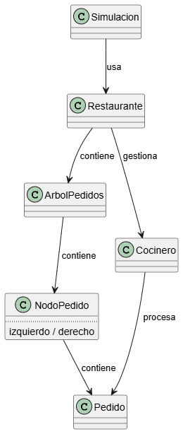

# PROPUESTA RETO 005

## [ENUNCIADO](https://github.com/mmasias/25-26-EDA1/blob/main/evaluaciones/retos/005/README.md)

---

# 📌 Modelo de Clases

A continuación se describe la arquitectura final basada en **Restaurante**, **Cocinero**, **ColaPedidos como árbol binario**, y una clase mínima `Simulacion` que únicamente ejecuta la aplicación.

---

## Clase `Pedido`

Representa un pedido gestionado en la cocina. En la implementación actual la clase es mínima y contiene los campos necesarios para la política SPT usada por la cola.

### Atributos privados

- `id` : int — Identificador único del pedido.
- `tipo` : String — Tipo de plato (bebida, café, colacao, bocadillo, ensalada…).
- `tiempoPreparacion` : int — Tiempo total necesario para preparar el pedido (entero en minutos).

### Métodos públicos

- `Pedido(int id, String tipo, int tiempoPreparacion)`
- `int getId()`
- `String getTipo()`
- `int getTiempoPreparacion()`
- `int compareTo(Pedido otroPedido)` — Orden natural: menor tiempo de preparación tiene mayor prioridad; en empate, menor `id` (llegada) gana.
- `String toString()`

---

## Clase `NodoPedido`

Nodo del árbol binario que contiene un `Pedido` y referencias a sus hijos y padre. Esta clase es pequeña y tiene getters/setters con aserciones para evitar auto-referencias.

### Atributos privados

- `pedido` : Pedido
- `izquierdo` : NodoPedido
- `derecho` : NodoPedido
- `padre` : NodoPedido

### Métodos públicos

- `NodoPedido(Pedido pedido)`

Los setters (`setIzquierdo`, `setDerecho`, `setPadre`) usan `assert` para evitar asignar un nodo como hijo/padre de sí mismo.

---

## Clase `ArbolPedidos`

Implementación de la cola de prioridad mediante un árbol binario de búsqueda orientado a SPT (Shortest Processing Time). En el código se llama `ArbolPedidos` y gestiona nodos `NodoPedido`.

### Atributos privados

- `raiz` : NodoPedido
- `cantidadPedidos` : int

### Métodos públicos

- `ArbolPedidos()`
- `void insertar(Pedido nuevoPedido)` — Inserta respetando el orden SPT (usa `compareTo` de `Pedido`).
- `Pedido extraerMin()` — Extrae el pedido con menor tiempo de preparación.
- `boolean estaVacia()`
- `int tamaño()`

---

## Clase `Cocinero`

Representa al cocinero encargado de preparar los pedidos. `asignarPedido` recibe el `instanteInicio` para estadísticas.

### Atributos privados

- `pedidoActual` : Pedido
- `tiempoRestanteActual` : int
- `instanteInicioActual` : int

### Métodos públicos

- `boolean estaOcupado()`
- `void asignarPedido(Pedido pedido, int instanteInicio)`
- `Pedido obtenerPedido()`
- `int getTiempoRestante()`
- `Pedido procesarUnMinuto()`

---

## Clase `Estadisticas`

Registra métricas de la simulación.

### Atributos privados

- `cantidadAtendidos` : int
- `cantidadPendientes` : int
- `tiempoTotalDeEspera` : double

### Métodos públicos

- `Estadisticas()`
- `void registrarInicioDePreparacion(Pedido pedido)`
- `void registrarPedidoTerminado(Pedido pedido)`
- `String generarResumen()`

---

## Clase `TipoPlato`

Gestiona los tipos de plato y su tiempo estimado de preparación. La implementación actual devuelve tiempos enteros (minutos).

### Métodos estáticos públicos

- `String muestrearTipo()`
- `int generarTiempoParaTipo(String tipo)`

_(Esta clase no usa `enum` por decisión de diseño en este repo.)_

---

## Clase `Restaurante`

Clase principal que controla toda la lógica de la simulación.

### Atributos privados

- `arbolPedidos` : ArbolPedidos
- `cocinero` : Cocinero
- `estadisticas` : Estadisticas

### Métodos públicos

- `Restaurante()`
- `void ejecutar(int minutos)`

### Detalles de ejecución

- En cada minuto se puede generar un nuevo `Pedido` (probabilidad configurable), se asigna al `Cocinero` si está libre y se procesa un minuto.
- Se usan `assert` en puntos claves (precondiciones) para ayudar en pruebas y detectar supuestos rotos cuando se ejecuta la JVM con `-ea`.

---

## Clase `Simulacion`

Clase mínima que solo inicializa y lanza el `Restaurante`.

### Métodos públicos

- `main(String[] args)`
  - Crea un objeto `Restaurante`.
  - Ejecuta `Restaurante.ejecutar(minutosTotales)`.

---

## ESQUEMAS – Diagramas UML

<table>
  <tr>
    <td align="center">
      
    </td>
    <td align="center">
      
    </td>
  </tr>
</table>
