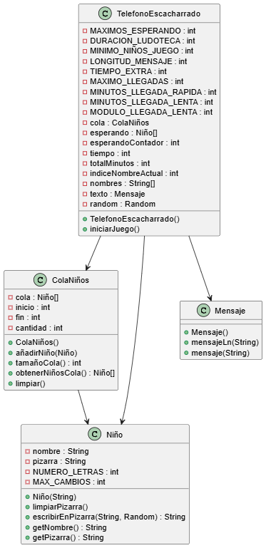
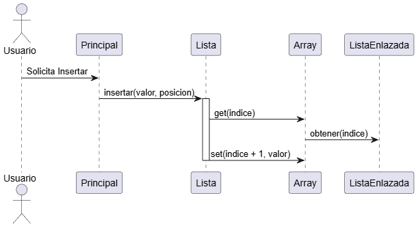

# Documentación Técnica: Sistema de Gestión de Lista Dinámica (Reto-007)

---

## 1. Diseño Orientado a Objetos (HOOD)

### Diagrama de Clases (PlantUML)

## 2. Vista Pública y Colaboraciones

| Clase | Responsabilidad | Colabora con |
| :--- | :--- | :--- |
| **Nodo** | Almacena el dato y el enlace al siguiente. | - |
| **ListaEnlazada** | Maneja el encadenamiento físico de nodos. | Nodo |
| **Array** | Simula memoria contigua de tamaño fijo. | ListaEnlazada |
| **Lista** | Gestiona la inserción/borrado y el crecimiento. | Array |

## 3. Corrección de Vicios (Calidad del Código)
Para cumplir con los estándares de la asignatura y los criterios del profesor, se han aplicado los siguientes cambios:

- **Programación Defensiva (`assert`):** Se han eliminado los `if` con `System.out.println` dentro de las clases de lógica. Ahora se usan `assert` para validar precondiciones, asegurando que el error se detecte en la fase de desarrollo.

- **Eliminación de saltos de control (`break`):** En la clase `Principal`, se ha sustituido el `switch` por una estructura `if-else if` para mantener un flujo estructurado y limpio.

- **Encapsulamiento:** Todos los atributos de clase son `private`. La comunicación entre objetos se realiza exclusivamente mediante métodos públicos (Vista Pública).

- **Modularidad:** Se ha separado la lógica de "localización de nodos" en métodos privados para evitar la duplicación de bucles.

## 4. Diagrama de Secuencia (PlantUML)

