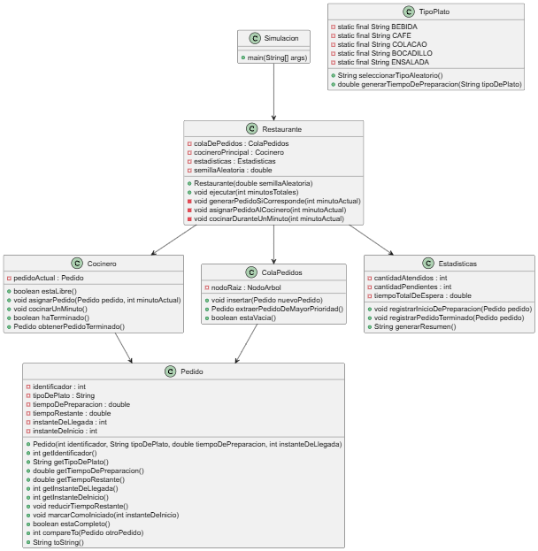

# PROPUESTA RETO 005

## [ENUNCIADO](https://github.com/mmasias/25-26-EDA1/blob/main/evaluaciones/retos/005/README.md)

---

# 📌 Modelo de Clases

A continuación se describe la arquitectura final basada en **Restaurante**, **Cocinero**, **ColaPedidos como árbol binario**, y una clase mínima `Simulacion` que únicamente ejecuta la aplicación.

---

## Clase `Pedido`

Representa un pedido gestionado en la cocina.

### Atributos privados
- `identificador` : int — Identificador único del pedido.  
- `tipoDePlato` : String — Tipo de plato (bebida, café, colacao, bocadillo, ensalada…).  
- `tiempoDePreparacion` : double — Tiempo total necesario para preparar el pedido.  
- `tiempoRestante` : double — Tiempo restante por cocinar.  
- `instanteDeLlegada` : int — Momento en que el pedido llega al Restaurantee.  
- `instanteDeInicio` : int — Momento en que el cocinero comienza a prepararlo.  

### Métodos públicos
- `Pedido(int identificador, String tipoDePlato, double tiempoDePreparacion, int instanteDeLlegada)`  
- `int getIdentificador()`  
- `String getTipoDePlato()`  
- `double getTiempoDePreparacion()`  
- `double getTiempoRestante()`  
- `int getInstanteDeLlegada()`  
- `int getInstanteDeInicio()`  
- `void reducirTiempoRestante()`  
- `void marcarComoIniciado(int instanteDeInicio)`  
- `boolean estaCompleto()`  
- `int compareTo(Pedido otroPedido)` — SPT: menor tiempo → mayor prioridad; en empate, llega antes.  
- `String toString()`  

---

## Clase `NodoArbol`

Nodo del árbol binario que contiene un pedido.

### Atributos privados
- `pedido` : Pedido — Pedido almacenado en el nodo.  
- `nodoIzquierdo` : NodoArbol — Hijo izquierdo.  
- `nodoDerecho` : NodoArbol — Hijo derecho.  

### Métodos públicos
- `NodoArbol(Pedido pedido)`  

---

## Clase `ColaPedidos`

Cola de prioridad basada en un **árbol binario de mínima prioridad** siguiendo la política SPT.

### Atributos privados
- `nodoRaiz` : NodoArbol — Raíz del árbol de prioridad.  
- `cantidadPedidos` : int — Número total de pedidos almacenados.  

### Métodos públicos
- `ColaPedidos()`  
- `void insertar(Pedido nuevoPedido)` — Inserta manteniendo la mínima prioridad.  
- `Pedido extraerPedidoDeMayorPrioridad()` — Extrae el pedido con menor tiempo de preparación.  
- `boolean estaVacia()`  

---

## Clase `Cocinero`

Representa al cocinero encargado de preparar los pedidos.

### Atributos privados
- `pedidoActual` : Pedido — Pedido que se está cocinando actualmente.  

### Métodos públicos
- `boolean estaLibre()`  
- `void asignarPedido(Pedido pedido, int instanteActual)`  
- `void cocinarUnMinuto()`  
- `boolean haTerminado()`  
- `Pedido obtenerPedidoTerminado()`  

---

## Clase `Estadisticas`

Registra métricas de la simulación.

### Atributos privados
- `cantidadAtendidos` : int  
- `cantidadPendientes` : int  
- `tiempoTotalDeEspera` : double  

### Métodos públicos
- `Estadisticas()`  
- `void registrarInicioDePreparacion(Pedido pedido)`  
- `void registrarPedidoTerminado(Pedido pedido)`  
- `String generarResumen()`  

---

## Clase `TipoPlato`

Gestiona los tipos de plato y su tiempo estimado de preparación.

### Métodos estáticos públicos
- `String seleccionarTipoAleatorio()`  
- `double generarTiempoDePreparacion(String tipoDePlato)`  

*(Esta clase no usa enum porque lo has pedido explícitamente.)*

---

## Clase `Restaurante`

Clase principal que controla toda la lógica de la simulación.

### Atributos privados
- `colaDePedidos` : ColaPedidos  
- `cocineroPrincipal` : Cocinero  
- `estadisticas` : Estadisticas  
- `semillaAleatoria` : double  

### Métodos públicos
- `Restaurante(double semillaAleatoria)`  
- `void ejecutar(int minutosTotales)`  

### Métodos privados
- `void generarPedidoSiCorresponde(int minutoActual)`  
- `void asignarPedidoAlCocinero(int minutoActual)`  
- `void cocinarDuranteUnMinuto(int minutoActual)`  

---

## Clase `Simulacion`

Clase mínima que solo inicializa y lanza el Restaurantee.

### Métodos públicos
- `main(String[] args)`  
  - Crea un objeto `Restaurante`.  
  - Ejecuta `Restaurante.ejecutar(minutosTotales)`.

---

## ESQUEMA – Diagrama UML

