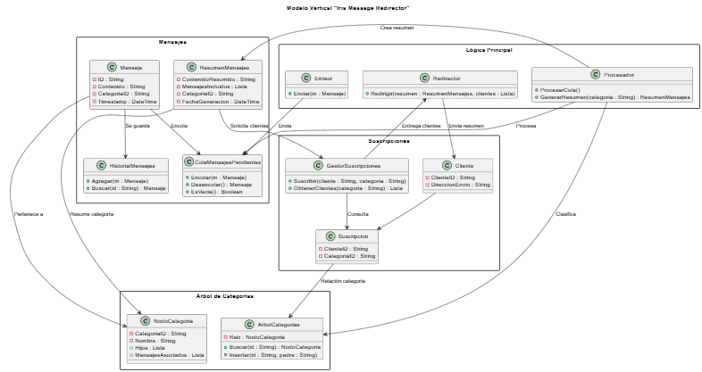

# Uso de Estructuras de Datos

Este documento explica dónde y por qué se utilizan **listas**, **colas** y **árboles** (y por qué **no** se usan pilas) dentro del diseño del proyecto *Iris Message Redirector*, siguiendo únicamente el temario de **Estructuras de Datos y Algoritmos**.

---

# 🧩 Descripción general del sistema

El sistema gestiona el flujo completo de mensajes categorizados:

1. El **Emisor** recibe un mensaje.
2. El mensaje se almacena en una **cola de mensajes pendientes**.
3. El **Procesador** extrae mensajes de la cola y los clasifica en un **árbol de categorías**.
4. Se genera un **resumen** de los mensajes por categoría.
5. El sistema obtiene los **clientes suscritos** a esa categoría.
6. Un **Redirector** envía el resumen a cada cliente.

Para construir este sistema se emplean exclusivamente estructuras del temario de EDA:

- ✔ Listas  
- ✔ Colas  
- ✔ Árboles 

---

# 📂 1. Uso de Listas

Las listas se utilizan en todas aquellas zonas donde se necesita almacenar **conjuntos de elementos sin una regla especial de extracción**.

### ✔ 1.1. `ResumenMensajes`
- `MensajesIncluidos` es una **lista** de mensajes.
- Se usa para agrupar todos los mensajes relacionados en un resumen.

### ✔ 1.2. `NodoCategoria`
Cada nodo del árbol guarda dos listas:
- `Hijos`: lista de nodos subcategoría.
- `MensajesAsociados`: lista de mensajes clasificados en esa categoría.

### ✔ 1.3. `GestorSuscripciones`
- El método `ObtenerClientes(categoria)` devuelve una **lista** de clientes suscritos.

### ✔ 1.4. `HistorialMensajes`
- Utiliza una **lista** para registrar los mensajes ya procesados.

**Motivo general para el uso de listas:**  
Se recorren de manera secuencial, permiten almacenar múltiples elementos y son simples de manejar dentro del temario.

---

# 📦 2. Uso de Colas (FIFO)

La cola se usa cuando el orden de llegada debe respetarse estrictamente.

### ✔ 2.1. `ColaMensajesPendientes`
Implementa una cola FIFO clásica:
- `Encolar(mensaje)`
- `Desencolar()`
- `EsVacia()`

**Motivo:**  
Los mensajes deben procesarse en el mismo orden en que llegaron.  
Esta cola funciona como el **buffer de entrada** del sistema.

---

# 🌳 3. Uso de Árboles

El árbol se utiliza para modelar la **jerarquía de categorías**.

### ✔ 3.1. `ArbolCategorias`
- Contiene la raíz del árbol.
- Permite buscar e insertar categorías.

### ✔ 3.2. `Nodoategoria`
- Cada nodo representa una categoría.
- Contiene una lista de hijos y mensajes asociados.

**Motivo:**  
Las categorías forman natural y lógicamente una estructura jerárquica (categoría → subcategoría → sub-subcategoría).  
Un árbol permite organizar y buscar eficientemente dentro de esa jerarquía.

---

# 🧠 Resumen rápido por tabla

| Módulo                         | Estructura usada | Razón                                |
|-------------------------------|------------------|---------------------------------------|
| `ColaMensajesPendientes`      | Cola (FIFO)      | Procesar en orden de llegada          |
| `NodoCategoria → Hijos`       | Lista            | Múltiples subcategorías               |
| `NodoCategoria → Mensajes`    | Lista            | Agrupar mensajes asignados            |
| `ResumenMensajes`             | Lista            | Reunir mensajes en un resumen         |
| `GestorSuscripciones`         | Lista            | Clientes suscritos                    |
| `ArbolCategorias`             | Árbol            | Jerarquía de categorías               |
| `HistorialMensajes`           | Lista            | Registro secuencial                   |

---

