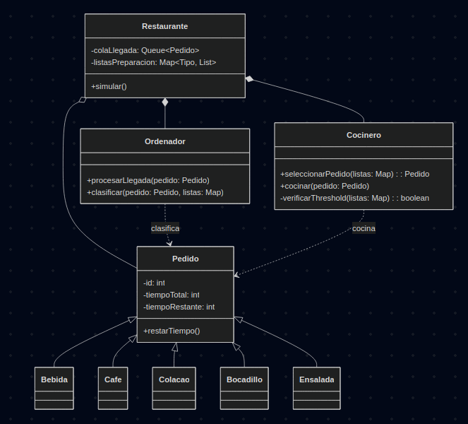

# Reto 005 - Propuesta de Solucion

## Descripcion

- En este reto se nos ha solucitado implementar un restaurante en el que solamente hay 1 persona atendiendo a los clientes. Es el mismo que hace la funcion de cocinero, camarero y servicio al cliente.

### Primera aproximacion a estructuras

- Dentro de lo que pide el reto, se solictar implementar una priorizacion en base a los tiempos de preparacion de los platos de comida. Ademas de la funcionalidad que cada minuto va a llegar 1 cliente, con un pedido aleatorio de los 5 platos disponibles.

- Para las estructuras planteo primero implementar una cola en la que se van almacenando los cliente que van llegando, luego se va acceder a los elementos de esta cola para ordenarlos a 2 listas enlazadas entre si, la primera lista tendra los pedidos que se van accediendo de la cola, y la segunda tendra un id del pedido, y el orden en el que se van a ir preparando. 

#### Problematica de primera aproximacion

- Esta fue la priemra aproximacion que se me ocurrio pero tras analizarla, me doy cuenta que almacenar los ids hace que si llega un pedido de mayor prioridad a otros ya almacenados tendria que rescribir el order de la lista, lo cual no es eficiente ni una buena practica.

### Segunda aproximacion

- De manera inicial voy a implementar una cola en la que se van almacenando los clientes que van llegando, pero a la hora de ordenarnos se van almacenando en arbol binario de busqueda, donde cada nodo tendra unicamente dos hijos. Definiendo de esta manera siempre cual sera el pedido en el que se va a atender primero.

    - Criterios de insercion:

- Donde en el arbol binario de busqueda se va a almacenar el pedido, se va a almacenar el pedido con el tiempo de preparacion como clave, y el pedido como valor. De esta manera se va a poder acceder al pedido con el tiempo de preparacion mas pequeño, y asi poder atenderlo primero. 

#### Problemas de tercera aproximacion

- El problema principal de almacenar los pedidos y el orden de esta manera es que se introduce una complejidad de $O(\log n)$ para todas sus operaciones. 

### Tercera aproximacion

- Otra aproximacion puede ser el almacenar los pedidos al llegar en una cola, y en esa cola accedemos y las guardamos en una lista por cada uno de los pedidos segun su tiempo de preparacion.

- Guardamos los elementos de la lista con todo lo que debemos preparar y hasta que no terminemos con esa lista no podremos acceder a la siguiente lista. 

- Para la posibilidad que nuestros pedidos de mayor tiempo se queden estancados, podemos implementar para que si el tamaño de las listas supera un threshold (como puede ser 5), se atienda un pedido de menor prioridad para que los clientes no se queden estancados.

#### Diagrama de Clases

