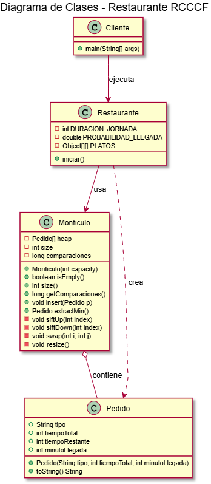

# Propuesta de Solución: Reto RCCCF

## 1. Análisis del Problema

El reto consiste en simular una cocina donde los pedidos se atienden no por orden de llegada (FIFO), sino priorizando aquellos con menor tiempo de preparación. Esto implica que necesitamos una estructura de datos que nos permita:

1.  **Insertar** nuevos pedidos eficientemente.
2.  **Extraer** eficientemente el pedido con el mínimo tiempo de preparación.

### Estructuras consideradas

*   **Lista no ordenada**: Insertar es **muy rápido**, pero buscar el mínimo es **lento** (hay que mirar todos).
*   **Lista ordenada**: Buscar el mínimo es **muy rápido**, pero insertar es **lento** (hay que mover elementos).
*   **Montículo Binario (Min-Heap)**: Tanto insertar como extraer son operaciones rápidas y eficientes.

Dado que el sistema es dinámico (llegan pedidos y salen pedidos constantemente), el Min-Heap (implementado como `Monticulo`) es la estructura más eficiente para minimizar el costo computacional global.

## 2. Diseño de la Solución (UML)

## 3. Detalles de Implementación

La solución se ha estructurado siguiendo principios de Programación Orientada a Objetos (POO), separando la lógica en clases con responsabilidades claras:

### Clase `Pedido`
Representa el modelo de datos de un pedido individual.
*   `tiempoTotal`: Para estadísticas finales.
*   `tiempoRestante`: Es la clave de prioridad. Se reduce minuto a minuto.
*   `minutoLlegada`: Para calcular el tiempo de espera.

### Clase `Monticulo`
Implementa la estructura de datos Min-Heap para gestionar la cola de prioridad.
*   **Propiedad del montículo**: Para todo nodo `i`, `heap[i].tiempoRestante <= heap[hijos(i)].tiempoRestante`.
*   **Insertar**: Añade al final y realiza siftUp para restaurar la propiedad.
*   **ExtractMin**: Retira la raíz (mínimo), mueve el último elemento a la raíz y realiza siftDown para restaurar la propiedad.

### Clase `Restaurante` (Lógica de Simulación)
Contiene la lógica del negocio y controla el bucle de tiempo (minuto a minuto).
1.  Genera nuevos pedidos aleatoriamente (40% prob).
2.  Asigna trabajo al cocinero (extrae del Montículo si está libre).
3.  Procesa el pedido actual (reduce tiempo restante).
4.  Recopila estadísticas.

### Clase `Cliente` (Ejecución)
Es el punto de entrada (`main`). Su única responsabilidad es instanciar el `Restaurante` e iniciar la simulación.

## 4. Análisis de Complejidad

| Operación | Lista Ordenada | Lista Desordenada | Montículo (Min-Heap) |
| :--- | :--- | :--- | :--- |
| **Insertar** | Lento (proporcional a N) | Instantáneo | Muy Rápido |
| **Extraer Mínimo** | Instantáneo | Lento (proporcional a N) | Muy Rápido |
| **Rendimiento Global** | Lento | Lento | **Eficiente y Equilibrado** |

Para una jornada larga con muchos pedidos acumulados, el Montículo ofrece el mejor rendimiento balanceado.
