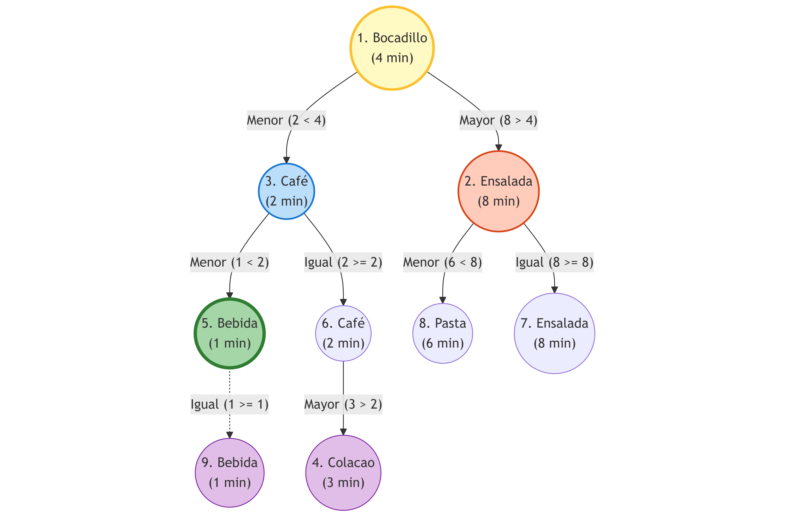
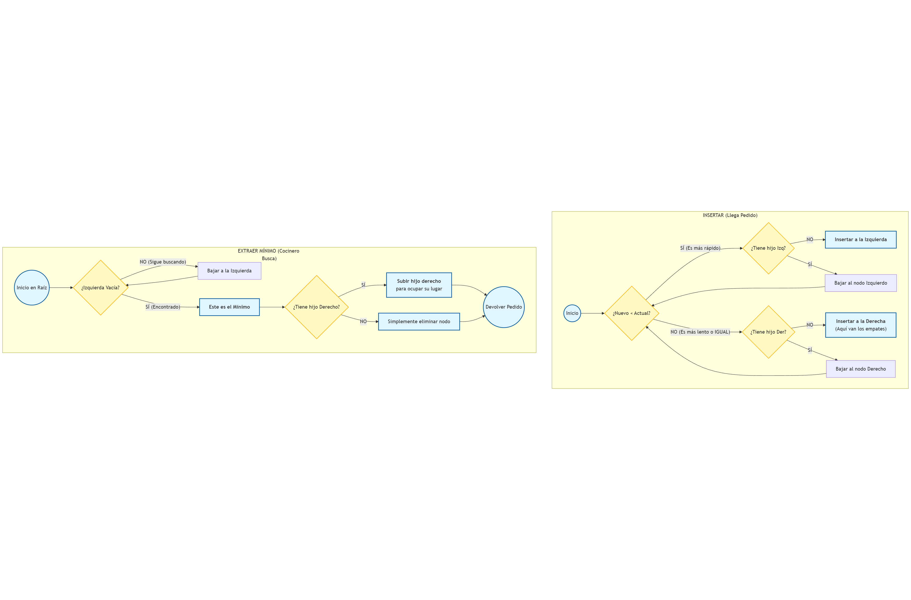
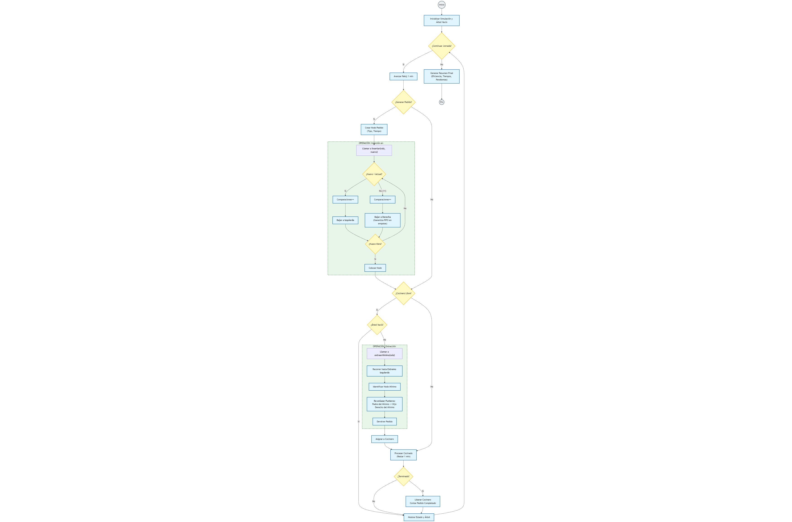
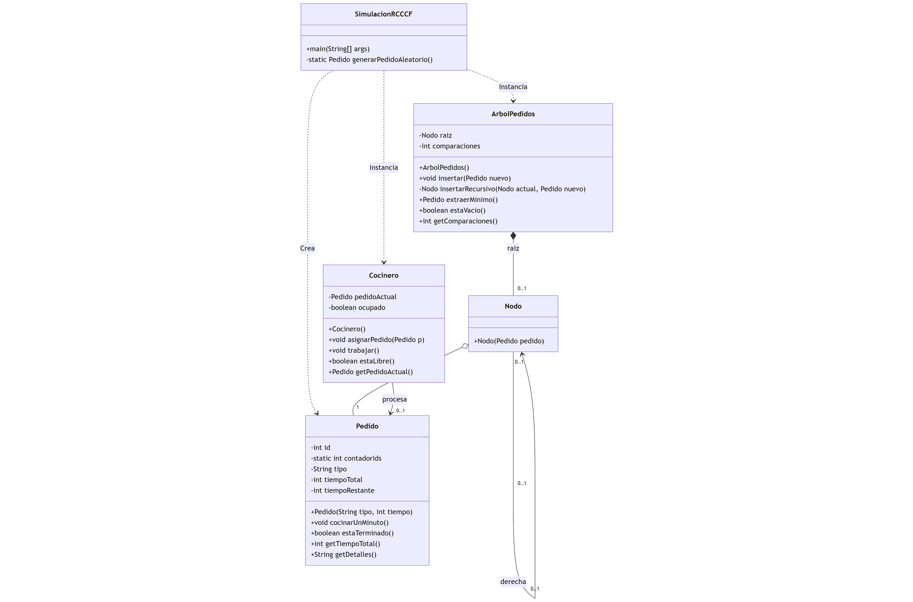

# Reto RCCCF

[Enunciado](enunciado.md)

## Ideas

~~[Planteamiento De Entrega](planteamientoDeEntrega.md)~~

## Implementación

### Cola de prioridad

Utilizaremos un sistema de arbol binario.

*Ej*: 

El diseño de entrada y salida sería este:

Por lo que le flujo de trabajo sería:

Y las clases serían algo como (borrador inicial):

