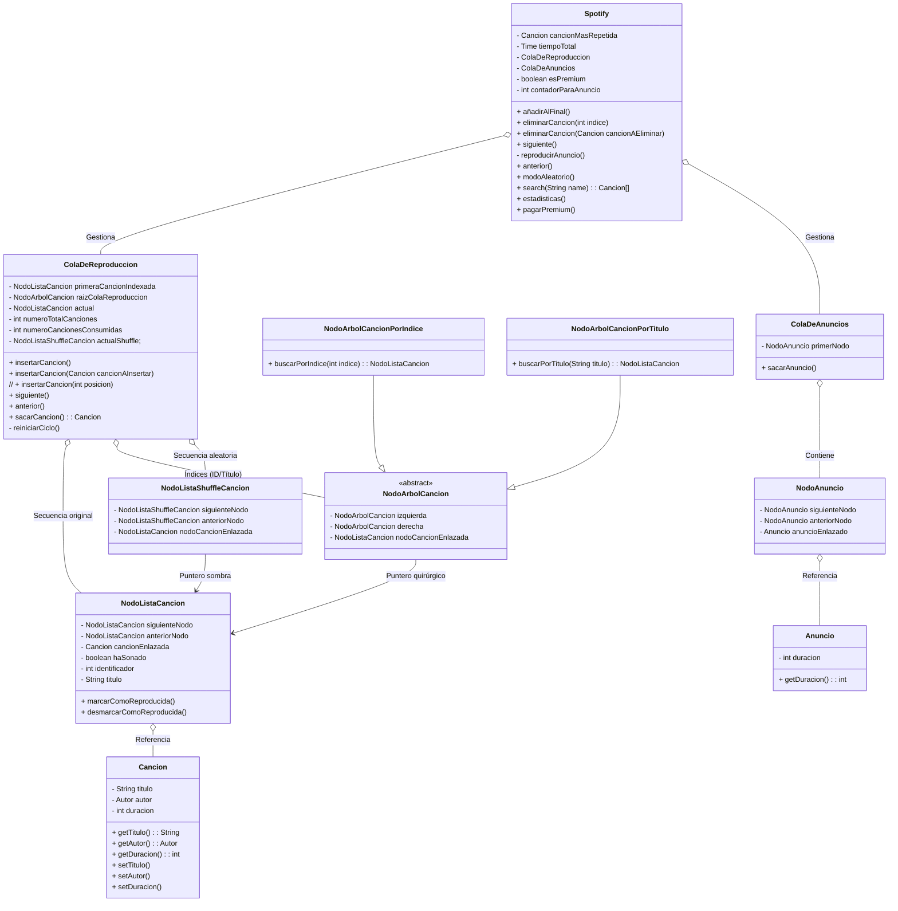

# PySpotify

[Enunciado](./enunciado.md)

## Propuesta

A ver, aunque Spotify en realidad es una red de nodos _---o, mejor dicho un plano N dimensional donde cada dimension representa una variable distinta a tener en cuenta para ordenar las canciones---_ como no sabemos programar eso tomaremos referencia de lo que si sabemos.

### Justificación de Estructuras

#### Búsqueda e Indexación (Dual Tree)

**¿Qué he decidido?**
Uso de dos árboles de búsqueda (ID y Título) que heredan de una clase abstracta NodoArbolCancion.

**¿Por qué?**
Garantiza búsquedas en $O(\log n)$ tanto para procesos automáticos del sistema como para búsquedas manuales del usuario.

_Puntero Quirúrgico_: Cada nodo del árbol referencia directamente al NodoListaCancion. Esto permite que, tras localizar la canción, el borrado en la lista sea $O(1)$ al no tener que recorrerla para encontrar sus punteros anterior y siguiente.

#### Navegación y Shuffle (Shadow Lists)

**¿Qué he decidido?**
Uso de NodoListaShuffleCancion (Nodos Sombra).

**¿Por qué?**
Permite una navegación aleatoria bidireccional sin destruir el orden cronológico de la lista principal. Los nodos sombra son ligeros (solo punteros), cumpliendo la restricción de memoria limitada.

_Sincronización_: Al desactivar el shuffle, el puntero actual ya reside en la lista original, permitiendo retomar el orden natural instantáneamente.

#### Ciclo de Vida (Flag haSonado)

**¿Qué he decidido?**
Uso de un booleano haSonado en lugar de extracción física de nodos.

**¿Por qué?**
Mantener los nodos en la lista evita reconstruir la estructura cada vez que termina la playlist. El "reinicio" de la cola se convierte en una operación lineal simple $O(n)$ de reseteo de flags.
