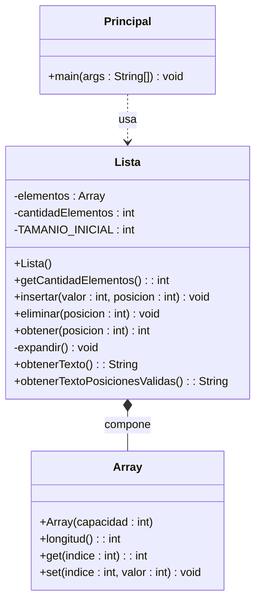
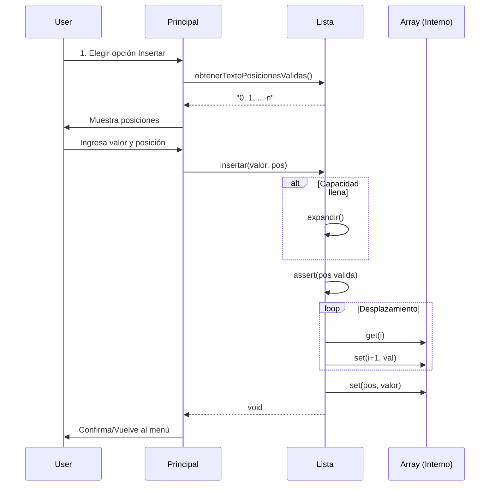

# Documentación Técnica: Lista de Enteros

## 1. Diseño Orientado a Objetos (HOOD)

### Diagrama de Clases

Representación estática de la estructura del sistema y las relaciones entre sus componentes.

## 2. Vista Pública y Colaboraciones

Resumen de responsabilidades y colaboraciones entre las clases del sistema.

| Clase         | Responsabilidad                                                                                                                                     | Colabora con          |
| :------------ | :-------------------------------------------------------------------------------------------------------------------------------------------------- | :-------------------- |
| **Principal** | Gestionar la interacción con el usuario (E/S), validar entradas básicas y coordinar el flujo del programa.                                          | `Lista` (Uso)         |
| **Lista**     | Gestionar la lógica de negocio de la estructura de datos: almacenamiento, inserción ordenada (física), eliminación y acceso a elementos abstractos. | `Array` (Composición) |
| **Array**     | Proveer una estructura de almacenamiento de tamaño fijo y acceso directo (simulación de memoria primitiva).                                         | -                     |

## 3. Diagrama de Secuencia

Interacción de objetos para la operación de **Insertar**.

