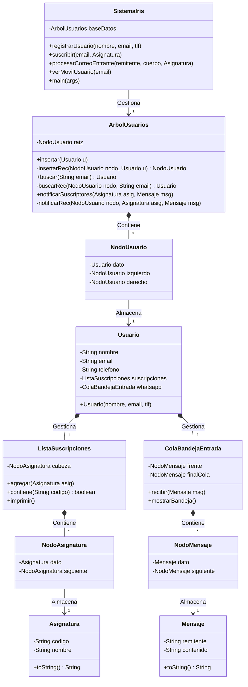

```mermaid
classDiagram
    %% --- CLASES DE DATOS (Payloads) ---
    class Asignatura {
        -String codigo
        -String nombre
        +toString() String
    }

    class Mensaje {
        -String remitente
        -String contenido
        +toString() String
    }

    class Usuario {
        -String nombre
        -String email
        -String telefono
        -ListaSuscripciones suscripciones
        -ColaBandejaEntrada whatsapp
        +Usuario(nombre, email, tlf)
    }

    class ListaSuscripciones {
        -NodoAsignatura cabeza
        +agregar(Asignatura asig)
        +contiene(String codigo) boolean
        +imprimir()
    }

    class NodoAsignatura {
        -Asignatura dato
        -NodoAsignatura siguiente
    }

    class ColaBandejaEntrada {
        -NodoMensaje frente
        -NodoMensaje finalCola
        +recibir(Mensaje msg)
        +mostrarBandeja()
    }

    class NodoMensaje {
        -Mensaje dato
        -NodoMensaje siguiente
    }

    class ArbolUsuarios {
        -NodoUsuario raiz
        +insertar(Usuario u)
        -insertarRec(NodoUsuario nodo, Usuario u) NodoUsuario
        +buscar(String email) Usuario
        -buscarRec(NodoUsuario nodo, String email) Usuario
        +notificarSuscriptores(Asignatura asig, Mensaje msg)
        -notificarRec(NodoUsuario nodo, Asignatura asig, Mensaje msg)
    }

    class NodoUsuario {
        -Usuario dato
        -NodoUsuario izquierdo
        -NodoUsuario derecho
    }

    class SistemaIris {
        -ArbolUsuarios baseDatos
        +registrarUsuario(nombre, email, tlf)
        +suscribir(email, Asignatura)
        +procesarCorreoEntrante(remitente, cuerpo, Asignatura)
        +verMovilUsuario(email)
        +main(args)
    }

    SistemaIris --> "1" ArbolUsuarios : Gestiona

    ArbolUsuarios *-- "*" NodoUsuario : Contiene
    NodoUsuario --> "1" Usuario : Almacena

    Usuario *-- "1" ListaSuscripciones : Gestiona
    Usuario *-- "1" ColaBandejaEntrada : Gestiona

    ListaSuscripciones *-- "*" NodoAsignatura : Contiene
    NodoAsignatura --> "1" Asignatura : Almacena

    ColaBandejaEntrada *-- "*" NodoMensaje : Contiene
    NodoMensaje --> "1" Mensaje : Almacena
```
