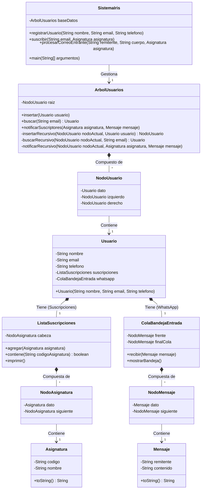

```mermaid
classDiagram
    %% --- CLASES DE DATOS (Payloads) ---
    class Asignatura {
        -String codigo
        -String nombre
        +toString() String
    }

    class Mensaje {
        -String remitente
        -String contenido
        +toString() String
    }

    class Usuario {
        -String nombre
        -String email
        -String telefono
        -ListaSuscripciones suscripciones
        -ColaBandejaEntrada whatsapp
        +Usuario(String nombre, String email, String telefono)
    }

    %% --- ESTRUCTURAS DE DATOS PROPIAS (EDA1) ---

    %% 1. LISTA ENLAZADA (Para Suscripciones)
    class ListaSuscripciones {
        -NodoAsignatura cabeza
        +agregar(Asignatura asignatura)
        +contiene(String codigoAsignatura) boolean
        +imprimir()
    }

    class NodoAsignatura {
        -Asignatura dato
        -NodoAsignatura siguiente
    }

    %% 2. COLA (Para la Bandeja de Entrada - FIFO)
    class ColaBandejaEntrada {
        -NodoMensaje frente
        -NodoMensaje finalCola
        +recibir(Mensaje mensaje)
        +mostrarBandeja()
    }

    class NodoMensaje {
        -Mensaje dato
        -NodoMensaje siguiente
    }

    %% 3. ÁRBOL BINARIO DE BÚSQUEDA (Base de Datos de Usuarios)
    class ArbolUsuarios {
        -NodoUsuario raiz
        +insertar(Usuario usuario)
        +buscar(String email) Usuario
        +notificarSuscriptores(Asignatura asignatura, Mensaje mensaje)
        
        %% Métodos recursivos privados con nombres completos
        -insertarRecursivo(NodoUsuario nodoActual, Usuario usuario) NodoUsuario
        -buscarRecursivo(NodoUsuario nodoActual, String email) Usuario
        -notificarRecursivo(NodoUsuario nodoActual, Asignatura asignatura, Mensaje mensaje)
    }

    class NodoUsuario {
        -Usuario dato
        -NodoUsuario izquierdo
        -NodoUsuario derecho
    }

    %% --- CONTROLADOR PRINCIPAL ---
    class SistemaIris {
        -ArbolUsuarios baseDatos
        +registrarUsuario(String nombre, String email, String telefono)
        +suscribir(String email, Asignatura asignatura)
        +procesarCorreoEntrante(String remitente, String cuerpo, Asignatura asignatura)
        +main(String[] argumentos)
    }

    %% --- RELACIONES ENTRE CLASES ---
    
    %% El sistema "tiene" la base de datos principal
    SistemaIris --> "1" ArbolUsuarios : Gestiona

    %% Composición del Árbol (Si el árbol muere, los nodos mueren)
    ArbolUsuarios *-- "*" NodoUsuario : Compuesto de
    NodoUsuario --> "1" Usuario : Contiene

    %% Composición del Usuario (Sus estructuras son parte de él)
    Usuario *-- "1" ListaSuscripciones : Tiene (Suscripciones)
    Usuario *-- "1" ColaBandejaEntrada : Tiene (WhatsApp)

    %% Composición de la Lista
    ListaSuscripciones *-- "*" NodoAsignatura : Compuesta de
    NodoAsignatura --> "1" Asignatura : Contiene

    %% Composición de la Cola
    ColaBandejaEntrada *-- "*" NodoMensaje : Compuesta de
    NodoMensaje --> "1" Mensaje : Contiene
```
