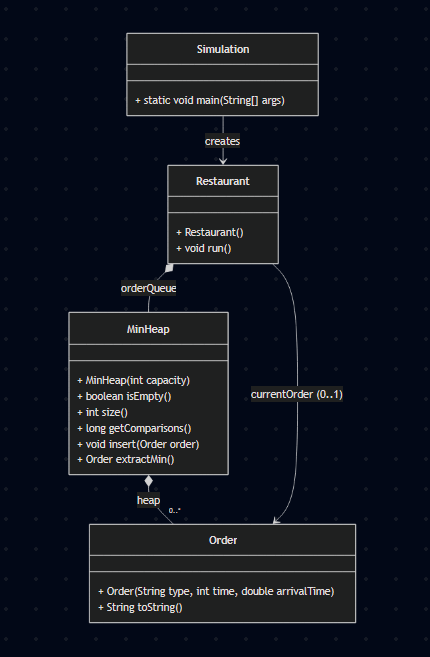

# Reto RCCCF: Simulación de Cocina

## Contexto del Problema

El restaurante **RCCCF** ha cambiado su modelo de atención. A diferencia de una caja de supermercado (FIFO), en la cocina se prioriza la **eficiencia del flujo**: se atienden primero los pedidos rápidos para maximizar el número de entregas.

**Regla de Negocio (Shortest Job First - SJF):**
* El cocinero siempre selecciona el pedido pendiente con el **menor tiempo de preparación**.
* La llegada de pedidos es aleatoria (40% de probabilidad por minuto).
* No hay pre-emption (el cocinero no interrumpe un plato a la mitad si llega uno más rápido, espera a terminar el actual).

---

## Objetivos del Reto

1.  **Modelar el sistema:** Clases para Pedidos, Cocinero y el Gestor de Cola.
2.  **Simular el tiempo:** Un bucle que represente la jornada minuto a minuto.
3.  **Medir la eficiencia:** Contar **cuántas comparaciones** realiza el algoritmo para decidir qué pedido sigue.
    * *¿Cuántas comparaciones se hacen si hay 50 pedidos en espera?*

---

## Arquitectura de la Solución

Para resolver el problema de eficiencia, no utilizamos una lista simple. Implementamos un **Arbol de Decisión Binario Simple**.

### Diagrama UML

