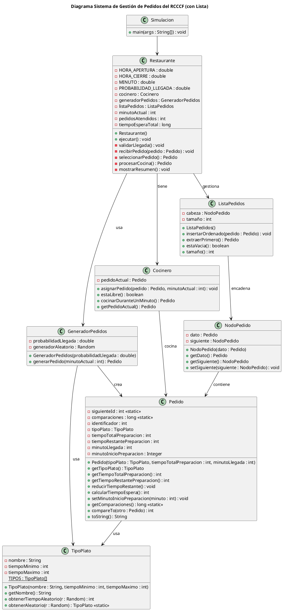
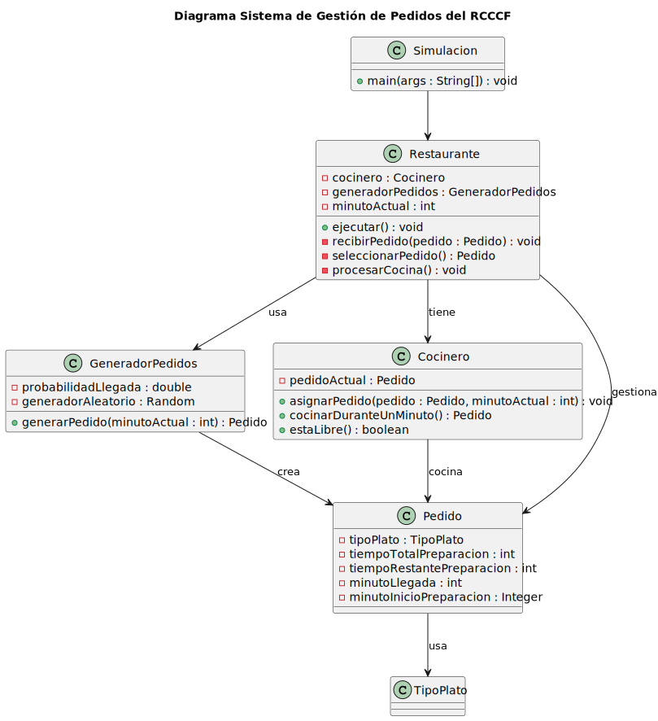

# Propuesta para el sistema RCCCF

El RCCCF requiere un sistema que administre pedidos que llegan de manera aleatoria y deben ser tratados conforme a su tiempo de preparación, no al orden en el que llegan.  
Así que la estructura de datos principal tiene que posibilitar de manera eficaz la inserción de pedidos y la obtención del que tarda menos tiempo prepararse.

## Comparación de estructuras de datos

**Cola FIFO**  
No sirve porque atiende en orden de llegada y aquí no queremos atender por orden de llegada, sino según el tiempo de preparación.

**Pila (LIFO)**  
Tampoco sirve porque atiende el último que entra primero, y en este sistema necesitamos otro criterio distinto.

**Lista**  
Es la opción que mejor encaja dentro de lo visto en clase, porque nos permite insertar los pedidos donde queramos.  
De esta forma, en el código podemos decidir en qué posición colocar cada pedido según su tiempo de preparación y así controlar cuál será el siguiente pedido que se atienda.

---

Entonces, la lista es la estructura adecuada porque nos da la flexibilidad necesaria para organizar los pedidos según lo que necesita el sistema.

---

# Diagrama UML del sistema

## Diagrama Sistema de Gestión de Pedidos del RCCCF

