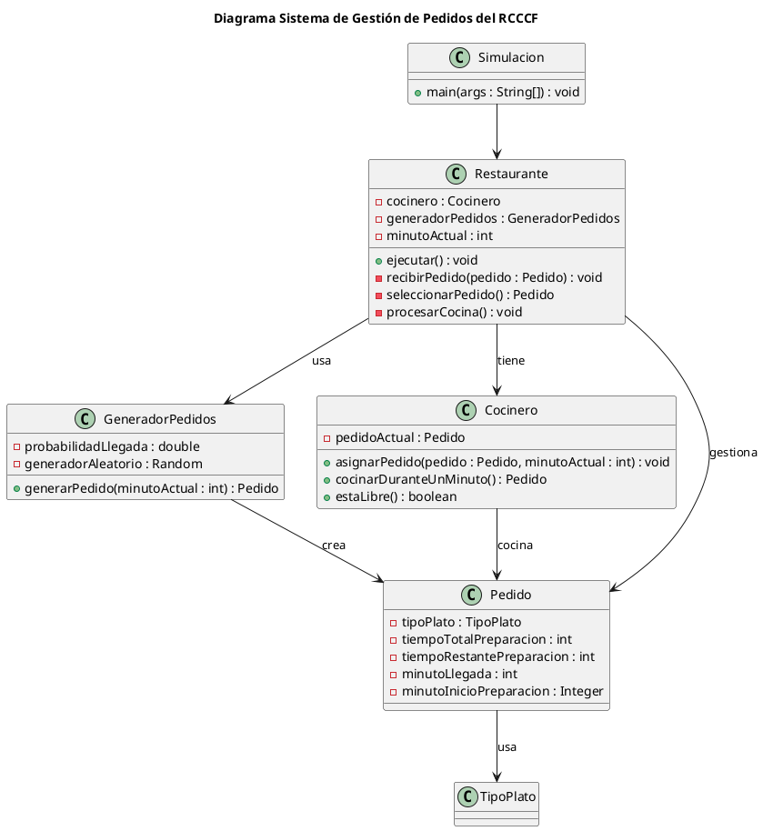

# Propuesta para el sistema RCCCF

El RCCCF requiere un sistema que administre pedidos que llegan de manera aleatoria y deben ser tratados conforme a su tiempo de preparación, no al orden en el que llegan.  
Así que la estructura de datos principal tiene que posibilitar de manera eficaz la inserción de pedidos y la obtención del que tarda menos tiempo prepararse.

## Comparación de estructuras de datos

**Cola FIFO**  
No sirve porque atiende en orden de llegada.

**Lista desordenada**  
Insertar es rápido, pero para encontrar el más corto hay que recorrerla entera. 

**Lista ordenada**  
Extraer el mínimo es inmediato, pero insertar es lento porque hay que buscar la posición correcta.  

**Árbol binario de búsqueda**  
Permite buscar y ordenar de forma decente, pero si crece de forma irregular puede acabar funcionando como una lista normal. 
Además, es más difícil de implementar.

**Cola de prioridad**  
Esta estructura está pensada justo para este tipo de problemas ya que permite añadir pedidos fácilmente y siempre deja el pedido más corto en la primera posición. Es muy eficiente incluso con muchos pedidos.  

---

Entonces, la cola de prioridad es la estructura adecuada porque permite seleccionar siempre el pedido con menor tiempo de preparación de forma eficiente.  

---

# Diagrama UML del sistema

## Diagrama Sistema de Gestión de Pedidos del RCCCF

