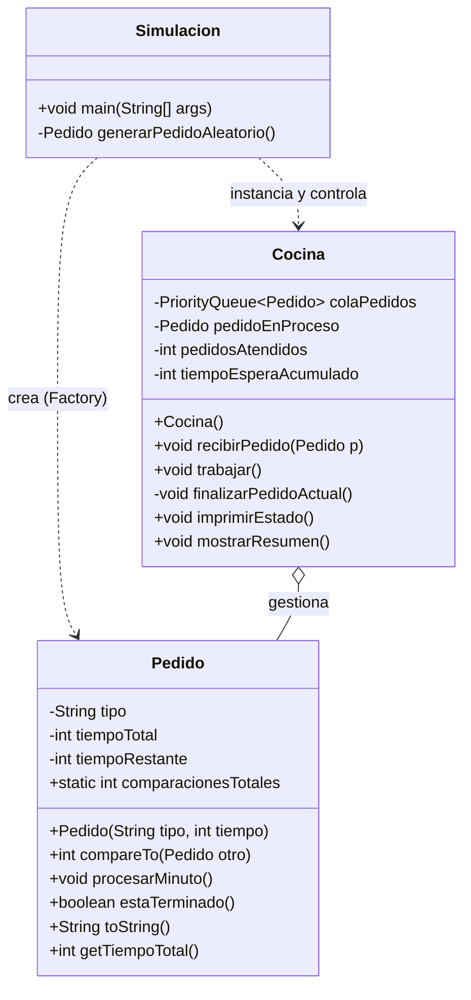

# Propuesta del Reto RCCCF

## Descripción del Problema
El reto consiste en simular la cocina del restaurante RCCCF, la cual opera bajo un modelo de eficiencia basado en el tiempo de preparación.

**Reglas Clave:**
*   **Prioridad por Tiempo**: El cocinero siempre elige el pedido que tarda menos en prepararse (Shortest Job First), no el que llegó primero.
*   **Llegada Aleatoria**: Cada minuto hay un 40% de probabilidad de que entre un nuevo pedido.
*   **Gestión Dinámica**: Si el cocinero termina un plato, inmediatamente comienza con el siguiente más rápido de la lista de pendientes.

## Diseño de la Solución

Para resolver este problema de manera estructurada, proponemos el siguiente diseño de clases:

## Diagrama de Clases

Aquí tienes el diagrama Mermaid generado que replica la estructura de tu imagen:

## Descripción de la Implementación

Vamos a implementar estas clases paso a paso.

1.  **`Pedido`**: Será la primera clase. Contendrá los datos del plato y la lógica de comparación.
2.  **`Cocina`**: Gestionará la cola de prioridad y las estadísticas.
3.  **`Simulacion`**: Ejecutará el bucle principal de la jornada.
