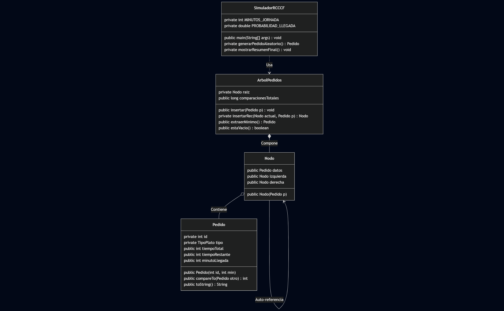

# Resolucion problema RCCCF
Nuestro objetivo con este ejercicio es modelar el funcionamiento de una cocina que prioriza los pedidos de menor duracion, para asi maximizar el flujo de trabajo (estrategia Shortest Job First). Habria que analizar las estructuras de datos vistas en clase para seleccionar la que se adapte mejor a este problema.

# Analisis de las estructuras de datos
La estructura de datos elegida sera un Árbol Binario de Búsqueda.

¿Cómo funciona el BST para este problema?
En un BST, los elementos se organizan de tal forma que:
- Los menores van a la izquierda.
- Los mayores van a la derecha.

Encontrar el pedido más rápido: No tienes que buscar en toda la estructura. Simplemente vas al hijo izquierdo una y otra vez hasta que no haya más. Ese es el mínimo.

# Implementacion
Implementacion de un Árbol Binario de Búsqueda al problema. 

Problema a tener en cuenta: 
Manejo de dublicados. Dado que es frecuente que dos platos tengan el mismo tiempo de preparación (ej. dos cafés de 3 min), el árbol debe Spermitir valores repetidos. Lógica: Al insertar, si el tiempo del nuevo pedido es menor o igual al nodo actual, se desvía a la rama izquierda. Si es mayor, a la derecha.
